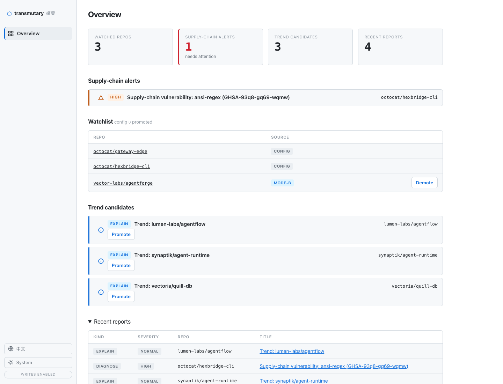
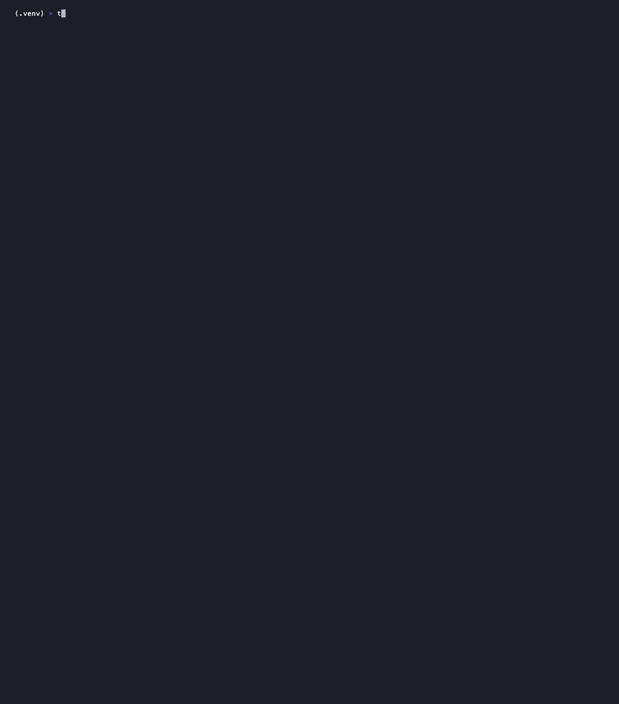

<div align="center">

# 嬗变 · Transmutary

**主动的开源生态情报 —— 持续观测仓库与依赖，把变化转成诊断报告，在出事前把要紧的推送给订阅者。**



<sub>看板 + 离线 demo：观测仓库、分诊供应链告警、晋升趋势候选，并用零凭据 demo 预览完整管线。<a href="#看板">打开看板 →</a></sub>

[](LICENSE)
[](https://www.python.org/)
[](https://github.com/SeasonTemple/transmutary/actions/workflows/ci.yml)
[](#测试)

[English](README.md) · [简体中文](README.zh-CN.md) · [为何](#为何做嬗变) · [看板](#看板) · [看 demo](#看-demo) · [快速开始](#快速开始) · [工作原理](#工作原理) · [发布](#发布与版本)

</div>

---

**嬗变（Transmutary）** 是面向「外部开源生态情报」的仓库观测系统。持续观测一批仓库及其依赖，把变化转成可读的诊断/说明报告，主动推送给订阅者——把「出事后被动核查」变成「主动感知」。

## 为何做嬗变

订阅者对所依赖的外部生态，反应是结构性滞后的：

- **依赖中断只能事后核查** —— 上游 CLI 工具一变，私有内部网关开始 504，只能手工让 LLM 去查两个仓。
- **无 AI 热门情报渠道** —— 快速崛起的工具出现在社交媒体，不在你拥有的任何 feed 里。
- **供应链投毒反应慢** —— 恶意 npm 包发布后才有人察觉。

嬗变用一条纯拉取、数据源全免费拼合的管线补上这些缺口，无需 webhook、无需付费 API。

## 两个观测模式

系统由**两条采集管线 + 一个共享投递层**组成（两条管线、一个投递层，非统一引擎）：

- **模式 A · 事件驱动（关注清单）** —— 盯订阅者重点维护/依赖的具体仓库，一有变化（release、issue 激增、供应链安全公告）即时检测、溯源诊断、分级推送。
- **模式 B · 定时跑批（趋势雷达）** —— 定期扫描指定范围（MVP 锁 AI 方向），发现 star 快速递增的新热门仓库并出说明摘要。

两模式只在采集阶段分叉，之后共用 `LLM 报告 → channel 投递（私有 RSS / 邮件）`。模式 B 发现的热门仓可晋升进模式 A 关注清单。

## 看 demo

一条命令看整条管线跑起来——**零凭据、零网络、零 LLM**：



```bash
pip install -e .
transmutary-demo
```

它把内置 mock 数据经 `httpx.MockTransport` + stub LLM 喂给*真实*管线（`build_runtime` + 三个 tick），全程不出进程：无 GitHub token、无 API key、无出站 HTTP、无模型调用。一拍产出一份 release 诊断、一份 issue 激增诊断（带依赖边 related 上下文）、一条由确定性 OSV 命中触发的供应链告警、三份趋势说明。

产物落在一个全新临时目录（运行开头打印；可用 `--out DIR` 指定），布局与真实 service 写入完全一致——目录 `0700`、文件 `0600`：

```
<artifact_root>/
├── octocat__hexbridge-cli/        # 按仓库归档的分析产物（权威，R24）
│   └── <ts>-diagnose.md
├── _delivered/
│   ├── immediate/                 # 高危路由：诊断 + 供应链告警
│   └── digest/                    # 摘要路由：趋势说明
└── _feed/
    ├── immediate.atom.xml         # 私有 RSS feed，按路由各一
    └── digest.atom.xml
```

运行还会打印产物树 + 几段渲染报告摘录，让你直接读到它会投递的输出。照抄上面两条命令即可复现——零配置。

CLI/demo 文案变化后，用下面命令刷新 README 终端 GIF：

```bash
vhs assets/demo.tape
```

`assets/demo.tape` 只录离线 `transmutary-demo` 命令。Web 看板图（`assets/dashboard.png`）应从浏览器截图刷新，这样 admin UI 才是用户真实看到的样子。

## 工作原理

```
收集 → 清洗 → 去重 → 筛选 → 报告 → 投递
```

- **纯拉取架构** —— 不依赖 webhook（无法对第三方仓库建 webhook），靠 Atom feed + REST 增量轮询。
- **清洗先于 LLM** —— 先做结构化检查（URL/内容指纹、staleness、可达性），过关内容才进 LLM 做 chunk 级相关性过滤。
- **确定性 API、语义才 LLM** —— 外部 API 走确定性代码，LLM 只做诊断/相关性/摘要；安全裁决与确定性 OSV/GHSA 命中交叉校验。
- **分级调度** —— 单常驻服务 + 内部分级周期：供应链分钟级、release/issue ~10 分钟、趋势日级。
- **安全基线** —— 不可信外部内容与指令结构隔离（防 prompt injection）、非 LLM 凭据只走 env、LLM key 走 env 或 `0600` 文件（见[凭据安全模型](#凭据安全模型)）、SSRF allowlist 禁重定向、产物私有访问受控。

## 快速开始

### 安装

```bash
python -m venv .venv
.venv/bin/pip install -e ".[dev]"
```

### 配置

复制示例配置并填写。非 LLM 凭据（GitHub token、SMTP、RSS）仅从环境变量读取。LLM 凭据可来自环境变量**或** `config/llm.yaml`（0600 权限）。

```bash
cp config/watchlist.example.yaml   config/watchlist.yaml
cp config/trend_scope.example.yaml config/trend_scope.yaml
cp config/delivery.example.yaml    config/delivery.yaml
export TRANSMUTARY_GITHUB_TOKEN=...      # 只读
```

**LLM 配置** — 三种方式（任选其一）：

```bash
# 方式 1：环境变量
export TRANSMUTARY_LLM_API_KEY=...       # 任意 LiteLLM 支持的 provider
export TRANSMUTARY_LLM_BASE_URL=...      # 可选：OpenAI/Anthropic-compatible 端点

# 方式 2：交互式 CLI 向导
.venv/bin/transmutary config

# 方式 3：Dashboard Settings 面板 → LLM Configuration
#           （启动 dashboard 后可用）
```

### 凭据安全模型

API key 的存储方式与同类工具一致（opencode、`llm`、aider，以及 `gh` / Claude Code 的 headless 降级路径都这么做）：**`0600` 文件 + 环境变量覆盖**，而非 OS keychain。

- **非 LLM 凭据**（GitHub token、SMTP、RSS）—— **仅环境变量**，transmutary 不落盘。
- **LLM key** —— 环境变量 `TRANSMUTARY_LLM_API_KEY` 优先；否则 `config/llm.yaml`，创建为 `0600`（仅属主读写）且 **gitignored**。dashboard 掩码显示（仅末 4 位），不回显。
- **env = 锁定层，dashboard/yaml = 可变运行时层。** 默认 LLM 配置经 dashboard / `transmutary config` 管理（写入 `config/llm.yaml`）。设置某个 `TRANSMUTARY_LLM_*` 环境变量会**锁定**该字段以供 ops 注入：env 始终胜出，且 dashboard 把该字段渲染为**只读**并标注变量名——UI 修改绝不会被静默忽略。自托管（以 dashboard 为配置入口）时让这些 env 变量留空即可。
- **为何不用 OS keychain？** transmutary 是长驻 headless 服务。keychain 假定有解锁的交互式会话；无人值守的 daemon 要存"解锁密钥"才能开 keychain——把明文密钥下移一层而非消除，还多 D-Bus/keyring 维护负担和已知 keychain footgun。`0600` 已满足单租户主机的真实威胁模型（挡其他用户/进程；用户态没有任何方案能挡已拿到服务用户 code-exec 的攻击者——keychain 也挡不了）。
- **daemon 的真正密钥管理在环境层** —— 用 systemd `EnvironmentFile=`（本身 `0600`）、Docker/Kubernetes secret 或 vault sidecar 注入 key，让 `config/llm.yaml` 留空。以专用非特权用户运行 transmutary。
- **本仓纵深防御** —— `.env` 和 `config/llm.yaml` 已 gitignore；`pre-commit` hook 扫描暂存内容的 key 模式（`sk-…`、`ghp_…`、`github_pat_…`、PEM 私钥），在 secret 进入 git 历史前拦截提交。

### Per-tier 模型

管线用三个模型 tier，各自可独立配置：

| Tier | 用途 | 默认 |
|------|------|------|
| **strong** | 诊断、issue 激增 L3 判定、critique/refine | `gpt-4o` |
| **cheap** | 供应链建议、趋势摘要 | `gpt-4o-mini` |
| **embed** | L2 语义分组（聚类 issue 激增 / 趋势候选，折叠 L3 调用） | `text-embedding-3-small` |

默认三者共用一个 provider（上面的共享 `api_key`/`base_url`/`transport`）。某 tier 可走**不同 provider**——设 per-tier 覆盖，`api_key`/`base_url`/`transport`/`model` 各字段未填时回落共享值。配置入口：dashboard 的「Per-tier 覆盖（高级）」折叠区、`transmutary config`、或环境变量 `TRANSMUTARY_LLM_<TIER>_<FIELD>`（如 `TRANSMUTARY_LLM_EMBED_BASE_URL`）。

**常见场景** —— chat 走一个 provider，embedding 走另一个（chat provider 无 embedding API）。设 embed tier 的 `base_url`/`transport`/`model`（key 不同则也设），其余继承共享 chat 配置。

**embed 可选。** 未配可用 embedding 端点时，L2 分组降级为全 L3（每个候选单独判定）——结果正确，只是 LLM 调用更多。不配 embed 是合法部署。

### 验证

```bash
.venv/bin/python -m pytest -q
.venv/bin/ruff check src tests
```

## 配置文件

| 文件 | 用途 |
|---|---|
| `config/watchlist.yaml` | 模式 A 仓库 + 手工依赖边 |
| `config/trend_scope.yaml` | 模式 B 范围过滤器（topics + keywords） |
| `config/delivery.yaml` | DB/产物路径、摘要发送时辰、可选 RSS feed 目录 + SMTP 收件人 |
| `config/llm.yaml` | LLM API key + 可选 base URL（0600 权限，环境变量优先） |

## 产物与存储

两个根，均在 `delivery.yaml` 配置。所有报告私有（文件 `0600`、目录 `0700`），gitignored 不入库。

```
<artifact_root>/
├── <owner>__<repo>/                       # 按仓库归档的分析产物（权威，R24）
│   └── <ts>-<kind>.md                     #   每份报告的溯源载体
├── _delivered/<route>/                    # 投递渲染的报告
│   └── <owner>__<repo>-<kind>.md          #   route = immediate(高危) | digest(摘要)
└── _feed/<route>.atom.xml                 # 私有 RSS feed，按路由各一

<state_db_path>  state.sqlite3  (SQLite, WAL)
  event_fingerprint   事件去重（release / advisory / issue 聚类）
  seen_set            7 天滚动已见集（产物差分）
  issue_baseline      每仓 issue 速率基线
  collect_cursor      每仓 since 增量游标（跨重启）
  star_snapshot       模式B star 快照（增速）
  subscriber_token    订阅者 RSS token（撤销 / 有效期）
  promoted_repo       晋升进关注清单的模式 B 候选仓（F4）
```

一拍流程：

```
collect (atom + REST 增量)
  → dedup (event_fingerprint / seen_set)
  → release 直诊   |   issue 走筛选漏斗 (L1 规则 → L2 语义分组 → L3 judge) → 诊断
  → diagnose (LLM + R18 质量门控 + OSV/GHSA 交叉校验)
  → 归档 per-repo 分析产物  +  投递 (路由 → _delivered/<route>/ + RSS；immediate 加邮件)
  → 持久化 state (推进游标 / 更新基线 / 记指纹)
```

路由按 severity：高危（malware/critical）→ `immediate` + 邮件；其余（或 R18 降级）→ `digest`。

## 晋升（模式 B → 模式 A）

晋升把模式 B 趋势候选仓加入有效关注清单，使其转由模式 A 盯着。用 `transmutary` CLI：

```bash
transmutary promote owner/repo            # 加入关注清单（持久化）
transmutary promote owner/repo --source manual
transmutary demote owner/repo             # 移除
transmutary list-watchlist                # config 仓 + 晋升仓，标注来源
```

有效关注清单 = `config 关注清单 ∪ promoted_repo`。CLI 是独立进程，只写共享的 `promoted_repo` 表；运行中的 service 由周期性 **reconcile** job（每 10 分钟）把逐仓 job 全量同步到有效清单，因此 promote/demote **无需重启** service 即生效。晋升不碰任何凭据。

## 部署

经 Docker 跑常驻服务（内嵌分级调度器）：

```bash
docker pull ghcr.io/seasontemple/transmutary:latest
cp .env.example .env            # 填凭据（gitignored，不入镜像）
# 备好 ./config/{watchlist,trend_scope,delivery}.yaml
#   delivery.yaml：state_db_path 与 artifact_root 指向 /var/lib/transmutary 下
docker compose up -d
# 可选：本机 dashboard/admin UI
docker compose --profile dashboard up -d dashboard
```

镜像以非 root 用户运行；凭据运行时从 `.env` 注入；状态 DB 与私有产物持久化在 `transmutary-state` 卷。dashboard profile 共享同一份 config 挂载与 state 卷，默认只绑定宿主机 `127.0.0.1:8787`，Settings UI 需要 `TRANSMUTARY_ADMIN_TOKEN`。若要公网访问，应放在 HTTPS / 鉴权 / 限流反代后。无 Docker 时直接跑入口：`transmutary-serve` 与 `transmutary-dashboard`（均读 `TRANSMUTARY_CONFIG_DIR`，默认 `config`）。

Release 镜像发布到 GHCR：`ghcr.io/seasontemple/transmutary:vX.Y.Z`、
`ghcr.io/seasontemple/transmutary:X.Y.Z` 与
`ghcr.io/seasontemple/transmutary:latest`。本地源码构建可用
`docker build -t transmutary:local .`，再以
`TRANSMUTARY_IMAGE=transmutary:local docker compose up -d` 启动。

## 看板

本地 Web 看板，浏览器里看系统运行态与产出——有效关注清单、最近诊断/说明报告、供应链告警、趋势候选、各仓运行态（issue 基线 / star 快照 / 游标）、feed 链接。

```bash
pip install -e ".[dashboard]"     # 加 jinja2（Starlette/uvicorn 已是核心依赖）
transmutary-dashboard             # 默认 http://127.0.0.1:8787
```

复用现有 Starlette 栈与 store 接口。localhost 下可在看板通过服务端确认流 promote/demote 模式 B 候选仓；POST 只写共享的 `promoted_repo` 表，常驻 service 下一轮 reconcile 自动拾取，无需重启。

Settings 区是带身份认证的 admin control plane，用于非 secret 配置：添加/移除跟踪仓、添加手工依赖边、编辑趋势 topics/keywords、调整邮件收件人与 digest hour、**配置 LLM API key + base URL**。它**不直接改 YAML 文件**（LLM 配置除外——写入 `config/llm.yaml`，0600 权限）。有效运行时配置 = `YAML base ∪ SQLite admin overrides ∪ promoted_repo`；service reconcile job 会免重启拾取仓库范围变化。GitHub/SMTP/RSS 凭据仍只走 env，不会通过 UI 输入、不会渲染、不会持久化；LLM API key 可通过 Settings 面板或 `transmutary config` CLI 安全配置。

安全姿态：默认绑 `127.0.0.1`；非 localhost 绑定**硬拒**除非显式传 `--allow-public`；公网绑定默认仍**只读**，必须再传 `--allow-public-writes` 才暴露写端点。Settings 写入要求 `TRANSMUTARY_ADMIN_TOKEN` 登录、签名 HttpOnly session cookie、double-submit CSRF、`SameSite=Strict`、Origin/Referer host 校验、同源 form action 与服务端校验。公网 admin 仍应放在 HTTPS、限流、仓名白名单之后。

外部仓库内容 HTML 转义防 XSS，危险 source URL 会被清空，凭据/token 绝不上页。文件系统路径（`state_db_path`、`artifact_root`、`feed_dir`）与 provider 凭据仍归 YAML/env 管理。

界面为现代侧边栏看板（stat tiles、Sentry 式 issue-stream 告警、severity 用色+图标+文字三通道编码便于无障碍），带亮/暗主题切换与中/英语言切换（均记忆，且服务端首屏即渲染对应语言，无闪屏）。per-request CSP nonce 让内联主题首屏脚本精确放行而不弱化策略。

**Agent 友好** —— 每个数据端点支持内容协商：传 `Accept: application/json`（或 `?format=json`）即返回 view-model JSON 而非 HTML，凭据/token 排除与 HTML 路径一致。`GET /llms.txt` 向 agent 描述端点结构（不含私有数据）。

### 局域网 / 内网访问

若需在内网暴露看板（如团队浏览或另一台机器上的反代），使用 `dashboard-lan` profile：

```bash
docker compose --profile dashboard-lan up -d dashboard-lan
```

该模式将宿主侧绑定为 `0.0.0.0:8787`，复用同一 `.env`、配置与 `transmutary-state` 卷。`--allow-public` 已启用（跳过 Host 校验并将 `csrf_secure` 设为 `False`，使 cookie 在明文 HTTP 下可用）。安全硬门全部保留：显式 opt-in、CSRF double-submit、`TRANSMUTARY_ADMIN_TOKEN` 认证。

**注意**：此模式在局域网使用明文 HTTP，仅在可信网络段运行。公网访问仍需放在 HTTPS 反向代理 + 鉴权 + 限流之后（参见上文安全姿态说明）。

## 架构与文档

- 领域术语表：[`CONTEXT.md`](CONTEXT.md)
- 调研规划（brainstorm）：[`docs/brainstorms/`](docs/brainstorms/)
- 实现计划：[`docs/plans/`](docs/plans/)

## 发布与版本

发布版本由 [python-semantic-release](https://python-semantic-release.readthedocs.io/) 自动化。版本号、changelog、tag、GitHub Release 均由 `main` 上的 [Conventional Commits](https://www.conventionalcommits.org/) 推导：

- `feat:` → minor · `fix:` / `perf:` → patch · `BREAKING CHANGE:` → major。

GitHub Release 正文不再依赖自动生成说明。每个发布 tag 必须有
`docs/release-notes/vX.Y.Z.md` 双语说明，包含 `## 中文` 与 `## English`；
release workflow 发布后会用该文件覆盖 Release body。发布产物包括 Python
wheel/sdist 和 GHCR Docker 镜像。

clone 后启用一次本地提交校验钩子：

```bash
git config core.hooksPath .githooks
git config commit.template .gitmessage
```

机器生成的发布历史见 [`CHANGELOG.md`](CHANGELOG.md)，双语发布说明策略见
[`docs/release-workflow.md`](docs/release-workflow.md)。

## 项目

### 状态

| 阶段 | 状态 |
|---|---|
| 需求 + 计划 | ✅ 完成（多轮评审） |
| Phase 0 — 共享骨架（U1-U5, U14） | ✅ 完成 |
| Phase 1 — 模式 A（采集/诊断/投递/供应链） | ✅ 完成 · F1 真实仓里程碑已验收 |
| Phase 2 — 模式 B（趋势雷达） | ✅ 完成 |
| Phase 3 — 调度接线（pipeline + service） | ✅ 完成 |
| Phase B — F4 晋升 · 部署 · L2 语义分组 · critique→refine | ✅ 完成 |
| 离线 demo（`transmutary-demo`） | ✅ 完成 |
| Web 看板（`transmutary-dashboard`） | ✅ 完成 |
| 测试 | ✅ 440 passing · ruff clean |

### 路线图

按设计延后：channel 接口抽象、Web secret 存储/轮换、多用户 RBAC/OAuth、订阅配置、真实常驻控制。（Web 看板、admin 非 secret 设置 UI、一键 promote/demote UI、L2 语义分组、可选的 critique→refine 报告增强均已实现——见[看板](#看板)与[工作原理：可选的批判→修订](#工作原理可选的批判修订r11)。）

### 测试

```bash
.venv/bin/python -m pytest -q      # 440 passing
.venv/bin/ruff check src tests     # clean
```

### 贡献

见 [CONTRIBUTING.md](CONTRIBUTING.md)：开发环境、Conventional Commits 规范（由 `.githooks/commit-msg` 强制）、自动发布流程。PR 提向 `main`。

### 许可

[Apache-2.0](LICENSE) © SeasonTemple


## 工作原理：可选的批判→修订（R11）

诊断报告（模式 A）与说明报告（模式 B）都支持**可选**的三段式提质：
`综合（出初稿）→ 批判 → 修订`，**默认关闭**。在每次 tick 上经
`run_release_issue_tick` / `run_trend_tick` 的 `refine_reports=True` 显式开启。

- **综合**：出单次初稿（即现状行为）。
- **批判**：让模型对照证据批判自己的初稿（未据证断言 / 遗漏 / 逻辑漏洞）。
- **修订**：据批判改写初稿，且不超出所给证据。

批判 / 修订**指令**进可信 system 槽；初稿、批判、证据一律只进不可信 data 槽
（注入隔离，KTD3）。关键点：**修订稿不豁免任何安全管控**——诊断的修订稿照过与
初稿完全相同的 OSV/GHSA 交叉校验 + 裁决脱敏 + R18 源门控；批判→修订只在「初稿生成」
之前运行，绝不绕过其后的安全管线（KTD-C）。任一阶段 LLM 故障即降级回初稿，报告
绝不因此产不出（KTD-D）。`refine_reports=False`（默认）时行为与此前完全一致。
