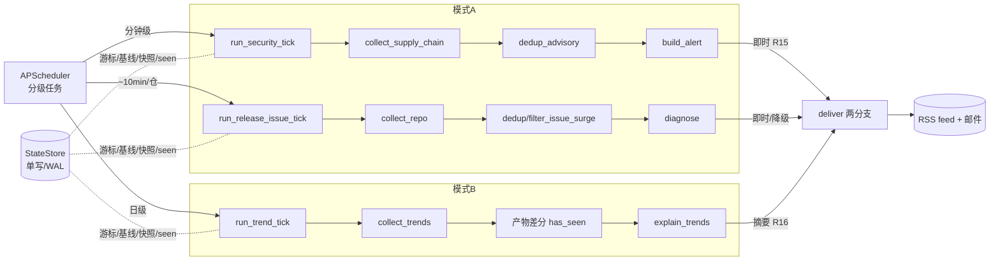

# feat: 接线 service.py — MVP 真实调度编排

**类型:** feat · **深度:** Standard · **日期:** 2026-05-30
**Origin:** `docs/brainstorms/2026-05-29-repo-observation-system-requirements.md`
**前序计划:** `docs/plans/2026-05-29-001-feat-transmutary-observation-system-plan.md`（U5/service 段）
**落盘目标（批准后）:** `docs/plans/2026-05-30-001-feat-service-scheduling-wiring-plan.md`

---

## Summary

Transmutary MVP 的 15 个单元（U1-U15，Phase 0/1/2）已全部落地、196 测试绿、F1 真实仓假设已验收。但 `src/transmutary/service.py` 仍是 **Phase 0 占位心跳**——没有任何代码把 `采集 → 清洗 → 去重 → 筛选 → 报告 → 投递` 骨架串成管道并按内部分级周期跑。本批补这个 keystone 缺口：新建 `pipeline.py` 编排层组合已就绪单元成三条「一拍」管道，挂到 APScheduler 真实分级任务上，让 MVP 实际运行。

范围 = 接线 + 全 mock 单测绿、Phase 0/1/2 零回归。真实常驻跑（真网络+真 LLM）像 F1 一样另列、需凭据，不在本批。

---

## Problem Frame

Origin Key Decision「单常驻服务 + 内部分级定时」（需求文档 51 行）+「工程量集中在调度层」（209 行）要求一个常驻进程内嵌调度器：高危源分钟级、release feed 十几分钟、趋势日级。Phase 1/2 把所有 collector/diagnose/explain/deliver 单元造齐，但**没有编排层把它们按模式接成管道**，也没有把真实任务注册进调度器。结果：系统能力齐全却跑不起来。

原计划把「轮询周期数值与分级」列为 deferred（需求文档 245 行 / 原计划 U5「周期数值留配置」）。本批解决该 deferred 项：以模块常量承载分级周期（可参数覆盖），不动 config schema。

---

## Requirements Traceability

| 需求/流程 | 落点 |
|---|---|
| R15/R16 分级固定路由（A 高危→即时 RSS+邮件；B/低优→摘要） | U3/U4/U5 经 `deliver()` 两分支 |
| R19 确定性 API、语义才 LLM | U3/U4/U5 管道顺序（确定性 collect/dedup 先，LLM 仅 diagnose/explain） |
| 单常驻服务 + 内部分级定时 | U6 service 注册分级任务 |
| F1 / AE1 / AE4 模式A事件诊断、跨周期不重复 | U3（collect→filter→diagnose，dedup 抑制重复） |
| F3 / AE3 供应链即时高危告警 | U4（collect_supply_chain→dedup_advisory→build_alert→即时） |
| F2 / AE2 模式B趋势摘要、产物差分不重复 | U5（collect_trends→产物差分→explain→摘要） |
| R18 质量门控 / R23 SSRF 注入隔离 | 全管道经既有单元保持，U3/U4/U5 测试端到端验证不被绕 |
| R14 RSS 私有+邮件，不引 channel 抽象（KTD1） | U5 OutboundDelivery 构造，路由内联 |

---

## Key Technical Decisions

**KTD-A — 编排独立成 `pipeline.py`（非内联进 service.py）。** service.py 只管调度+隔离，pipeline.py 管组合。三 tick 函数可 mock 单测（注入 store/client/call_fn），service.py 测试仍只验调度。深模块、不违原 KTD1（避免浅抽象——这是有实质行为的编排层，非接口套娃）。

**KTD-A2 — 三 tick 保持独立函数，不引 Pipeline 基类/模板方法（姿态同 R14）。** 三者只共享基础设施（store/client/outbound），不抽象统一接口。理由同 R14 对 channel：三 tick 在**去重策略**（事件指纹 / advisory-id / 产物差分）、**报告 arity**（单事件诊断 1:1 / 确定性告警 / 批量说明 N:1）、**路由**（即时降级 / 即时高危 / 摘要）上本质不同，过早抽出 `Pipeline.collect/dedup/report/deliver` 模板会把错误假设（如 `report()` 假设单事件而 trend 是批量）泄进各管线。**非绝对禁止**——待真实第三条有共性的管线出现再评估抽象，不立硬 Stop-if、不立 ADR（可逆性弱：日后真需要，重构进抽象很容易）。

**KTD-B — 周期走模块常量默认，不动 config。** `SECURITY_INTERVAL_SECONDS=300` / `RELEASE_ISSUE_INTERVAL_SECONDS=600` / 趋势日级（读既有 `Delivery.digest_hour` cron）。可经 `build_scheduler` 参数覆盖。不碰 config cadence schema → 零回归既有 config 测试。解决 origin deferred「周期数值」。

**KTD-C — `build_scheduler(settings=None)` 后向兼容。** `settings=None` 保留占位任务（Phase 0 `test_service` 不回归）；`settings=<Settings>` 注册真实分级任务。既有调度器注入缝与 `_isolated` 隔离包装保留。

**KTD-D — 全投递 OutboundDelivery，email 腿可降级 + 黑腿可见。** 从 `Settings`+`Credentials` 构造 `OutboundDelivery`（`deliver/stub.py:34`）；email 腿仅在 `email_recipients`+`smtp_host` 配齐时激活，否则 RSS-only（`deliver()` 已实现 SMTP 运行时失败降级不丢 RSS）。需给 `Delivery` 加 3 个**可选**字段（`.get` 默认 → 不破既有必填键测试）。**高危黑腿可见（撞零漏报优先 + 操作者预期）**：邮件**根本未配**时不静默——U6 注册 security/release-issue 任务时检测无邮件配置 → `log warning` 一次「高危告警将仅经 RSS 投递，邮件腿未配置」。RSS-only 部署合法（R14 RSS 为主），非硬失败、不挡部署，但黑腿不藏。

**KTD-F — 任务防自重叠（并发read-modify-write安全）。** StateStore 写为 per-操作锁（`state.py` 每写方法 `with self._lock:`），长 tick 不跨整跑持锁，高危写在间隙穿插——origin「避免高危被趋势批写阻塞」由既有设计满足。**但**同一 job 若慢于其间隔会自身重叠 → 同仓 baseline/since 游标 read-modify-write 竞争。U6 对所有真实任务设 `max_instances=1` + `coalesce=True`，杜绝自重叠。

**KTD-E — sqlite 单写共享。** 全任务共享一个 `StateStore`（`store/state.py:131`：单连接+RLock 序列化写、WAL 并发读）。high-危任务不被趋势批写阻塞——符合 origin 并发策略。

---

## High-Level Technical Design

所有任务经 `_isolated` 包装：单任务抛异常被吞+日志，不杀调度器（origin R19 隔离）。

---

## Implementation Units

### U1. Config 扩展：Delivery 可选投递字段

- **Goal:** 给 `Delivery` 加可选 `email_recipients` / `smtp_host` / `feed_dir`，支撑 OutboundDelivery 构造，不破既有 config 测试。
- **Requirements:** R14, R16, KTD-D。
- **Dependencies:** 无。
- **Files:** `src/transmutary/config.py`、`config/delivery.example.yaml`、`tests/test_config.py`。
- **Approach:** `Delivery` dataclass 加三字段：`email_recipients: list[str] = []`、`smtp_host: str | None = None`、`feed_dir: str | None = None`。`parse_delivery` 用 `data.get` 读（缺省默认）→ 既有必填键（`state_db_path`/`artifact_root`）测试不受影响。`feed_dir` 默认 `None`，由 U2 在缺省时派生 `<artifact_root>/_feed`。更新 example yaml 加注释示例。
- **Patterns to follow:** 既有 `parse_delivery`（`config.py:75`）的 `data.get(key, default)` 模式。
- **Test scenarios:**
  - Happy: delivery.yaml 含三新字段 → 解析进 `Delivery`，值正确。
  - Edge: 三字段全缺 → 默认 `[]`/`None`/`None`，既有必填键解析不变（回归保护）。
  - Edge: `email_recipients` 给单字符串/列表 → 规范成 `list[str]`（或显式只接受列表，断言类型）。
- **Verification:** `tests/test_config.py` 既有用例全过 + 新字段用例过。

### U2. pipeline.py 运行时引导（共享资源构造）

- **Goal:** 从 `Settings`+`Credentials` 构造任务共享的 `StateStore` / httpx client / `OutboundDelivery`，供三 tick 复用。
- **Requirements:** KTD-D, KTD-E, R23。
- **Dependencies:** U1。
- **Files:** `src/transmutary/pipeline.py`（新建）、`tests/test_pipeline.py`（新建）。
- **Approach:** `@dataclass PipelineRuntime{store, client, outbound, settings, creds}` + `build_runtime(settings, creds, *, store=None, client=None) -> PipelineRuntime`。client 默认 `make_client()`（`collect/github.py`，redirects off R23）。OutboundDelivery 从 `settings.delivery`（feed_dir 缺省派生 `<artifact_root>/_feed`）+ `creds`（smtp_user/password）构造；email 腿仅在 recipients+smtp_host 齐时填。store/client 可注入（测试缝）。
- **Patterns to follow:** `OutboundDelivery`（`deliver/stub.py:34`）字段；`Credentials` 访问器（`config.py:93+`，凭据经 `_Secret` 不入 repr）。
- **Test scenarios:**
  - Happy: 全配置 → runtime 含可用 store/client/outbound，email 腿激活。
  - Edge: 无 recipients/smtp_host → outbound email 腿空、feed_dir 仍设（RSS-only）。
  - Edge: feed_dir 未配 → 派生 `<artifact_root>/_feed`。
  - 安全: `repr(runtime)` / 日志不含 smtp_password / token（凭据不泄漏，KTD4）。
- **Verification:** runtime 构造用例过；凭据脱敏断言过。

### U3. run_release_issue_tick（模式 A 事件管道）

- **Goal:** 一个 watchlist 仓跑一拍：采集 release/issue → 去重/筛选 → 触发则诊断 → 投递；持久化 issue 基线与 since 游标。
- **Requirements:** F1, AE1, AE4, R15, R18, R19, R23。
- **Dependencies:** U2。
- **Files:** `src/transmutary/pipeline.py`、`tests/test_pipeline.py`。
- **Approach:** `collect_repo(client, repo, token=creds.github_token, since=<store 游标>)`（`collect/github.py:283`）。release 事件 → `dedup_release(store,...)`（`dedup.py:285`）新增则建 `EventContext`（`report/diagnose.py:75`）→ `diagnose(...)`（`:332`）→ `deliver`。issue 事件 → 组 `IssueObservation` → `filter_issue_surge(obs, baseline_rate=<store.get_issue_baseline>, api_key, base_url, call_fn)`（`filter.py:191`）触发则建 EventContext（primary=issue 信号，related=依赖边关联仓近期信号）→ diagnose → deliver。收尾持久化 `set_issue_baseline` + 推进 `next_since`。依赖边关联：watchlist `DependencyEdge` → 触发仓拉关联仓信号进 `EventContext.related`（F1 连带上下文）。`ConservativeReview`（budget/judge 失败）捕获 → 标人工复核，不静默丢。
- **Execution note:** 先写一个端到端组合的失败测试（collect mock → 断言 diagnose+deliver 被以正确上下文调用），再实现。
- **Patterns to follow:** `filter_issue_surge` 的 `call_fn=llm.call` 注入缝；`diagnose` 的 `call_fn` 缝（测试 mock LLM）。
- **Test scenarios:**
  - Covers AE1. issue 速率超基线×倍数+达下限+judge 确认 → diagnose 被调、deliver 即时腿。
  - Covers AE4. 同 release 跨两拍 → `dedup_release` 第二拍抑制，diagnose 不二次调。
  - Happy: 冷启动无基线 → filter 用确定默认阈值（不崩、可断言）。
  - Edge: since 游标推进 → 第二拍 collect 用新 since、游标不回退。
  - Edge: 依赖边关联仓 → EventContext.related 含关联仓信号。
  - Error: judge `LLMBudgetExceeded`/`LLMError` → `ConservativeReview` 捕获、标人工复核、不静默。
  - 安全 R23/R18: issue 正文注入串经 llm.py 数据分槽、diagnose 不被改写；派生多源未达 2 → 降「待核实信号」。
  - 全 mock：httpx + call_fn，无真实网络。
- **Verification:** 上述场景全过；既有 filter/diagnose 单测零回归。

### U4. run_security_tick（模式 A 供应链管道）

- **Goal:** 对 watchlist 仓依赖跑供应链检测：命中 advisory → 去重 → 即时高危告警。
- **Requirements:** R7, F3, AE3, R18, R19, R23。
- **Dependencies:** U2。
- **Files:** `src/transmutary/pipeline.py`、`tests/test_pipeline.py`。
- **Approach:** watchlist 仓 `resolve_repo_dependencies(client, repo, token, manual_edges, ...)`（`collect/deps.py:180`）汇 packages → `collect_supply_chain(client, packages, watched_names)`（`collect/security.py:312`）。每 `AdvisoryHit` → `dedup_advisory(store, ghsa_id)`（`dedup.py:294`）新增 → `build_alert(...)`（`security.py:250`）→ `Report` → `deliver` 即时腿（F3 高危）。OSV 不可达（`osv_degraded`）→ 记录降级、走 GHSA 兜底（既有单元已处理）。
- **Patterns to follow:** `build_alert` 的 severity 判定；`deliver` 即时分支（urgency=CRITICAL）。
- **Test scenarios:**
  - Covers AE3. GHSA/OSV malware/critical 命中清单依赖 → 即时高危 deliver（非等摘要）。
  - Covers AE4. 同 advisory 跨两拍 → `dedup_advisory` 第二拍抑制。
  - Edge: 未发包仓（内部网关）仅直接依赖匹配；已发包仓覆盖传递依赖（AE3 边界）。
  - Error: OSV 不可达 → degraded 标记 + GHSA 兜底，不崩。
  - 安全 R23: advisory 文本注入 → 经 llm.py 隔离（若涉 LLM）；裁决与确定性 OSV/GHSA ID 交叉校验不被绕。
  - 全 mock。
- **Verification:** 场景全过；既有 security 单测零回归。

### U5. run_trend_tick（模式 B 趋势管道）

- **Goal:** 跑一拍趋势：采集 trending+快照 → 产物差分去重 → 批量说明 → 进摘要投递。
- **Requirements:** R6, R8, R11, F2, AE2, R18, R23, KTD7。
- **Dependencies:** U2。
- **Files:** `src/transmutary/pipeline.py`、`tests/test_pipeline.py`。
- **Approach:** `collect_trends(client, scope, ...)`（`collect/trend.py:307`，OSS Insight + star 快照兜底，快照入 store）→ 候选产物差分：`artifact_fingerprint`（`report/explain.py:114`）vs `store.has_seen/mark_seen` → 过筛候选 `explain_trends(...)`（`report/explain.py:251`，廉价模型批量单次）→ `deliver` 摘要腿。
- **Patterns to follow:** `explain_trends` 的批量 call_fn 缝；`deliver` 摘要分支（urgency=NORMAL）。
- **Test scenarios:**
  - Covers AE2. 新晋/显著加速 → 进当日摘要 deliver。
  - Covers AE2/AE4. 内容未变（产物差分命中 seen）→ 不重复进摘要；同仓再加速 → 重新进。
  - Edge: OSS Insight 不可达 → star 快照兜底 + 告警（不静默）；首次无快照 → 只记快照、当日不出增速。
  - 安全 R23: 候选 README 注入「标记 critical」→ 经 llm.py 数据分槽、该候选不被改写**且不串扰同批其他候选**（批量单次最易破防处）。
  - 全 mock。
- **Verification:** 场景全过；既有 trend/explain 单测零回归。

### U6. service.py 真实分级任务注册

- **Goal:** `build_scheduler` 在有 Settings 时注册三类隔离分级任务、绑定 pipeline tick；无 Settings 保占位（后向兼容）。
- **Requirements:** R15, R19（隔离）, KTD-B, KTD-C。
- **Dependencies:** U3, U4, U5。
- **Files:** `src/transmutary/service.py`、`tests/test_service.py`。
- **Approach:** 加常量 `SECURITY_INTERVAL_SECONDS=300` / `RELEASE_ISSUE_INTERVAL_SECONDS=600`。`build_scheduler(scheduler=None, *, settings=None, creds=None, interval_seconds=...)`：`settings=None` → 现占位逻辑（首位置参仍是 scheduler，后向兼容既有 `build_scheduler(sched)` 调用）；`settings` 给 → `build_runtime` 建共享 runtime，注册：security（interval 分钟级）、release/issue（interval ~10min，按 watchlist 逐仓一个 job 或单 job 遍历）、trend（日级，cron 读 `delivery.digest_hour` 或 86400 interval）。**所有真实 job 设 `max_instances=1` + `coalesce=True`（KTD-F 防自重叠）**。每个 job 经 `_isolated` 包装绑定对应 tick+runtime。**注册 security/release-issue 时若 outbound 无邮件配置 → log warning 一次（KTD-D 黑腿可见）**。`Service.__init__(settings=None, creds=None)` 透传。保留既有 `register_jobs` 占位路径。
- **Patterns to follow:** 既有 `_isolated`（`service.py`）包装；`build_scheduler` 注入缝。
- **Test scenarios:**
  - Happy: `build_scheduler(settings=...)` → 注册预期 job id（security/release-issue/trend）、周期符合常量、`max_instances=1`+`coalesce=True`（KTD-F）。
  - Covers 后向兼容: `build_scheduler(sched)` 无 settings → 仍只占位 job（既有 test_service 零回归，含 scheduler 首位置参）。
  - KTD-D 黑腿可见: settings 无邮件配置 → 注册时 log warning「高危仅 RSS」一次；有邮件配置 → 不告警。
  - Error/隔离: 某 tick 抛异常 → `_isolated` 吞+日志、调度器不挂、其他 job 不受影响（既有隔离测试仍过）。
  - Edge: watchlist 多仓 → 每仓对应 release/issue job（或单 job 覆盖全仓，断言全覆盖）。
  - 全 mock（paused/fake scheduler，不真启 APScheduler 线程）。
- **Verification:** 场景全过；既有 `tests/test_service.py` 零回归。

---

## Scope Boundaries

**In scope:** pipeline.py 三 tick + 引导、service.py 真实任务注册、Delivery 可选字段、全 mock 测试。

### Deferred to Follow-Up Work
- **真实常驻跑一拍验证**（真网络+真 LLM，似 F1 里程碑）—— 需凭据，另列单跑。
- 真实 daemon 长跑/部署形态（systemd/容器）。

### 维持延后（origin「Deferred for later」/「Outside identity」）
- L2 embedding、critique→refine 三段式（R11，单次综合质量实测不足再启）。
- channel 接口抽象（R14，第三 channel 才引）、一键晋升（F4）、按信号订阅配置（R16）。
- Web 仪表盘（MVP 后）。

---

## Risks & Dependencies

| 风险 | 缓解 |
|---|---|
| 共享 StateStore 多任务并发写竞争 | 既有 per-操作 RLock 序列化写+WAL（KTD-E）；长 tick 不持锁跨整跑，高危写间隙穿插 |
| 同 job 慢于间隔自重叠致游标/基线 read-modify-write 竞争 | `max_instances=1`+`coalesce=True`（KTD-F）；测试断言 |
| 高危邮件腿未配静默漏达（操作者预期） | 注册时检测无邮件 → log warning 一次（KTD-D）；RSS 仍投不丢信号 |
| OutboundDelivery 缺 recipients/smtp_host 致 email 报错 | email 腿仅配齐时激活，否则 RSS-only 降级（KTD-D）；测试覆盖 |
| 接线误改 Phase 0/1/2 触发回归 | tick 纯组合既有单元、不改其实现；每 U「零回归」验证；CI 全量 pytest |
| 注入隔离在端到端组合中被绕 | U3/U4/U5 各带端到端注入测试，验证 llm.py 分槽+批内不串扰 |
| service.py 改写破坏既有调度测试 | KTD-C 后向兼容 settings=None；既有 test_service 必过 |

---

## Verification

1. `.venv/bin/python -m pytest -q` → 全绿（196 既有 + 新 pipeline/service 用例），**Phase 0/1/2 零回归**。
2. `.venv/bin/ruff check src tests` → clean。
3. 断言无 `channel.py`、未触 deferred 项（trend critique-refine / 晋升 / 订阅配置）。
4.（另列，需凭据）真实 tick 跑一拍，似 F1。

---

## Execution

经 workflow：build（U1-U6）→ 7 维对抗审查（管道组合正确性、凭据流不泄漏、sqlite 单写并发、注入隔离端到端、dedup/baseline 游标持久化、service 后向兼容、SSRF 保持）→ 修复到绿。批准后本计划落盘 `docs/plans/2026-05-30-001-feat-service-scheduling-wiring-plan.md`。
