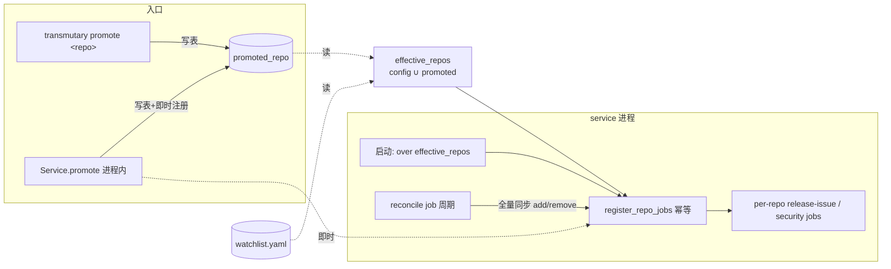

# feat: F4 一键晋升 — 模式B候选 → 模式A关注清单

**类型:** feat · **深度:** Standard · **日期:** 2026-05-30
**Origin:** `docs/brainstorms/2026-05-29-repo-observation-system-requirements.md`（F4，CONTEXT「晋升」词条）
**前序:** MVP Phase 0-3 完成（v0.2.0），pipeline+service 接线 live 验证通过

---

## Context

origin 把「一键晋升」（F4）列为 MVP 后延后项：把模式 B 趋势雷达发现的热门候选仓**加入模式 A 关注清单**，使其转由模式 A 持续盯（CONTEXT「晋升 promotion」）。这是两模式唯一的**交叉点**，origin 当初延后的理由是「跨模式状态写入，待两模式各自稳定再做」——现在 MVP 闭环、两模式都 live 验证过，时机到了。

难点（已摸缝确认）：`Settings`/`Watchlist`/`RepoEntry` 全 `frozen=True`、运行时不可变；观测仓集在 **service 启动时逐仓注册 job**（`service.py` over `settings.watchlist.repo_names()`）。所以晋升要解决：① 持久化晋升仓 ② 让运行中的 service 真观测到它，**且 CLI（晋升入口）与常驻 service 是不同进程**。

## 决策（已确认）

**KTD-A — 持久化 + 动态注册（非重启生效，非 sweep 重构）。** 新 `promoted_repo` 表持久化；运行中 service 经 **reconcile job** 周期性把已注册 per-repo jobs 同步到「有效清单」(config ∪ promoted)，免重启拉起新仓。复用 Phase 3 的逐仓 job 模型，零 job 模型重构。

**KTD-B — reconcile 桥接进程边界。** CLI `promote` 只写共享 `promoted_repo` 表（够不到 service 内存里的调度器）；service 的 reconcile job 读表做**全量同步**（注册缺失仓的 jobs / 移除已 demote 仓的 jobs）。这是 CLI→live-service 免重启的关键。`Service.promote()` 额外做进程内即时注册（即时生效便利）。

**KTD-C — agent-native 入口 = CLI + 库函数。** 「一键」UI 在 dashboard（延后）。本批交付**能力 + 入口**：`transmutary` console_script（`promote`/`demote`/`list-watchlist`）+ 底层库函数，人和 agent 都能调（CE agent-native parity）。dashboard 按钮日后调同一函数。

**KTD-D — 有效清单单一来源。** `effective_repos(settings, store)` = `config watchlist ∪ promoted` 去重、确定性排序。service 注册 + reconcile 共用，杜绝两处分叉。

---

## Requirements Traceability

| 需求 | 落点 |
|---|---|
| F4 一键晋升（模式B→A） | U1-U4 |
| CONTEXT「晋升 promotion」词条 | 实现对齐既有定义 |
| KTD1 不过早抽象 | 复用逐仓 job 模型，不重构成 sweep |
| 跨进程状态（origin 延后理由） | KTD-B reconcile 桥接 |
| agent-native parity（CE） | KTD-C CLI+库函数双入口 |

---

## High-Level Technical Design

CLI（独立进程）写表 → service 的 reconcile job 下一拍同步注册 → 晋升仓进入观测。进程内 `Service.promote` 走即时注册（不等 reconcile）。

---

## Implementation Units

### U1. promoted_repo 表 + StateStore 方法

- **Goal:** 持久化晋升仓集，提供增/删/查。
- **Requirements:** F4, KTD-A。
- **Dependencies:** 无。
- **Files:** `src/transmutary/store/state.py`、`tests/store/test_state.py`。
- **Approach:** `_SCHEMA` 加 `promoted_repo(repo TEXT PRIMARY KEY, source TEXT, promoted_at REAL)`（参照既有 `subscriber_token`/`seen_set` 增删模式，`with self._lock`）。方法：`promote_repo(repo, source="mode-b")`（INSERT OR REPLACE）、`demote_repo(repo)`（DELETE）、`list_promoted() -> list[str]`（确定性排序）、`is_promoted(repo) -> bool`。纳入 `dump_all_text`（凭据扫描一致性，非凭据但保持完整）。
- **Patterns to follow:** `add_subscriber_token`/`revoke_subscriber_token`/`mark_seen`（`state.py`）。
- **Test scenarios:**
  - promote → list_promoted 含该仓；重复 promote 幂等（不重复行）。
  - demote → list 不含；demote 不存在的仓不报错。
  - is_promoted 真/假。
  - 建表：`test_tables_created` 加 promoted_repo 断言。
- **Verification:** store 测试全过。

### U2. effective_repos 有效清单 helper

- **Goal:** 单一来源算 config ∪ promoted 的观测仓集。
- **Requirements:** F4, KTD-D。
- **Dependencies:** U1。
- **Files:** `src/transmutary/service.py`、`tests/test_service.py`。
- **Approach:** `effective_repos(settings, store) -> list[str]` = `settings.watchlist.repo_names()` 并 `store.list_promoted()`，去重 + 确定性排序（sorted）。放 service.py（编排关注，非纯 config）。
- **Test scenarios:**
  - 仅 config → 等于 config repo_names。
  - config + promoted → 并集去重；promoted 与 config 重叠不重复。
  - 确定性顺序（sorted 可断言）。
- **Verification:** 单测过。

### U3. service 动态注册 + reconcile + Service.promote/demote

- **Goal:** 启动 over 有效清单注册；reconcile job 周期全量同步；进程内 promote/demote 即时生效。
- **Requirements:** F4, KTD-A, KTD-B。
- **Dependencies:** U2。
- **Files:** `src/transmutary/service.py`、`tests/test_service.py`。
- **Approach:** 抽 `register_repo_jobs(scheduler, runtime, repo)`（幂等，`replace_existing=True`，含 release-issue + security 两 job，沿用 `max_instances=1`+`coalesce` KTD-F）。`unregister_repo_jobs(scheduler, repo)`（remove_job）。`build_scheduler(settings=)` 改为 over `effective_repos(settings, store)` 注册 + 注册一个 `reconcile` job（`RECONCILE_INTERVAL_SECONDS`，如 60s）：算有效清单 vs 当前已注册 per-repo job ids，注册缺失、移除多余。`Service.promote(repo, source)`：`store.promote_repo` + `register_repo_jobs`（即时）；`Service.demote(repo)`：`store.demote_repo` + `unregister_repo_jobs`。reconcile/promote 均经 `_isolated` 风格容错。
- **Test scenarios:**
  - 启动含 promoted 仓 → 注册其 jobs（有效清单生效）。
  - reconcile: 表新增 promoted 仓（模拟 CLI 跨进程）→ reconcile 后该仓 jobs 出现；demote 后 reconcile 移除。
  - Service.promote → 即时注册（不等 reconcile）、表有行。
  - 幂等: 重复 promote/reconcile 不产生重复 job（replace_existing）。
  - 后向兼容: 既有 placeholder / settings=None 路径不回归；trend 单 job 不受影响。
  - 全 mock（paused/fake scheduler）。
- **Verification:** 场景全过；Phase 3 service 测试零回归。

### U4. CLI 入口（promote / demote / list-watchlist）

- **Goal:** `transmutary` console_script，人/agent 可调晋升。
- **Requirements:** F4, KTD-C。
- **Dependencies:** U1, U2。
- **Files:** `src/transmutary/cli.py`（新建）、`pyproject.toml`（`[project.scripts]`）、`tests/test_cli.py`（新建）。
- **Approach:** `argparse` 子命令：`promote <owner/repo> [--source]`、`demote <owner/repo>`、`list-watchlist`（打印 config 仓 + promoted 仓，标注来源）。从 `TRANSMUTARY_CONFIG_DIR`/默认 `config` 载 settings（`require_credentials=False` —— 晋升不需凭据）、开 `StateStore(delivery.state_db_path)`、调 U1 库方法。`main()` 返回退出码。`pyproject.toml` 加 `[project.scripts] transmutary = "transmutary.cli:main"`。注：CLI 写表，运行中 service 经 reconcile 拾取（KTD-B）。仓名格式校验（owner/repo）。
- **Test scenarios:**
  - promote 子命令 → 表有行、退出 0、stdout 确认。
  - demote → 表移除。
  - list-watchlist → 列出 config + promoted、标来源。
  - 非法仓名（无斜杠/含 scheme）→ 非零退出 + 错误信息（不写表）。
  - require_credentials=False：无凭据 env 也能跑 promote（晋升不碰凭据）。
  - 全用临时 config dir + 内存/临时 sqlite，无网络。
- **Verification:** CLI 测试过；`transmutary promote` 真能写表。

### U5. 文档

- **Goal:** README + CONTEXT 体现晋升 CLI + promoted_repo 存储 + 流程。
- **Requirements:** F4。
- **Dependencies:** U1-U4。
- **Files:** `README.md`、`README.zh-CN.md`、`CONTEXT.md`。
- **Approach:** README「产物与存储」段 state 表加 `promoted_repo`；新增「晋升（promotion）」小节（`transmutary promote/demote/list-watchlist` 用法 + reconcile 免重启说明）。CONTEXT「晋升」词条补一句实现指针（promoted_repo 表 + reconcile）。EN+zh 对称。
- **Test scenarios:** Test expectation: none — 文档。
- **Verification:** 链接/锚点正确。

---

## Scope Boundaries

**In scope:** promoted_repo 持久化、有效清单、动态注册 + reconcile、CLI 三子命令、文档。

### Deferred to Follow-Up Work
- dashboard「一键」按钮（调本批 promote 函数；UI 延后）。
- 晋升仓的 dependency_edges 自动声明（当前晋升仓为独立观测仓、无自动边；config 边仍只能引用 config 仓）。
- 趋势报告内嵌 actionable 晋升链接（需投递层富交互）。

---

## Risks & Dependencies

| 风险 | 缓解 |
|---|---|
| CLI/service 跨进程，promote 不生效 | reconcile job 全量同步桥接（KTD-B）；测试模拟跨进程 |
| 动态注册产生重复 job | `replace_existing=True` + 幂等 register；测试断言 |
| reconcile 移除 config 仓 jobs（误删） | 有效清单含 config，全量同步只删「不在有效清单」的；测试覆盖 |
| 改 build_scheduler 破 Phase 3 service 测试 | 保 settings=None 占位路径；既有测试零回归 |
| 晋升仓被 config 边引用导致校验失败 | 文档化限制（晋升仓独立、不参与 config 边）；非本批 |

---

## Verification

1. `.venv/bin/python -m pytest -q` → 全绿（含新 store/service/cli 测试），Phase 0-3 零回归。
2. `.venv/bin/ruff check src tests` → clean。
3. `pip install -e .` 后 `transmutary promote owner/repo` 真写表、`list-watchlist` 真列出。
4.（可选 live）promote 一个真实热门仓 → 跑 release/issue tick 确认该仓被观测、产诊断。

---

## Execution

经 workflow：build（U1-U5）→ 对抗审查（reconcile 全量同步正确性含误删/重复、跨进程桥接、幂等、后向兼容、CLI 仓名校验/无凭据路径、文档对称）→ 修复到绿。批准后落盘 `docs/plans/2026-05-30-002-feat-promotion-f4-plan.md`。
