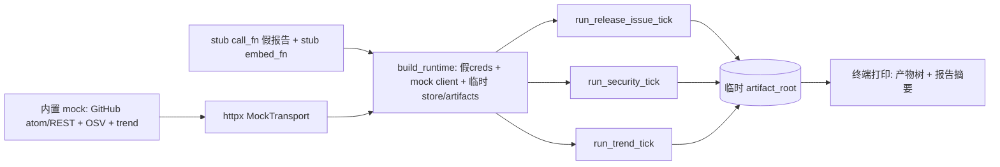

# feat: 离线 demo 脚本（零凭据零网络看嬗变跑起来）

**类型:** feat · **深度:** Standard · **日期:** 2026-05-31
**Origin:** 用户请求（README 需「看 demo」入口，让任何人零凭据复现系统输出）
**前序:** Phase B 完成 F4/部署/L2/critique-refine（v0.6.0），337 测试绿

---

## Context

系统功能完整（两模式管线 + 投递 + 调度），但「看它跑起来」目前要 GitHub + LLM 真实凭据 + 真网络——任何人想直观感受输出都得先配凭据。需要一个**离线 demo**：内置 mock 数据 + stub LLM，零凭据零网络跑一拍完整管线（采集→去重→筛选→诊断/说明→投递），落出真实报告/RSS/per-repo 产物 + 终端摘要。README 写「看 demo」= 跑它。

**关键教训（刚踩过）**：litellm import/调用拉网络会挂起。demo 必须 ① LITELLM 离线守卫已在 llm.py（import 时生效）② stub call_fn/embed_fn 不触真 LLM ③ mock httpx.Client 不触真网络。

---

## 决策（已确认）

**KTD-A — demo 复用既有注入缝，不重写管线。** `build_runtime(store=, client=, artifacts=)` + tick 的 `call_fn=`/`embed_fn=`/`snapshot_candidates=` 全可注入。demo 喂：mock `httpx.Client`（MockTransport 返假 GitHub atom/REST + OSV + OSS Insight 响应）+ stub `call_fn`（确定性假诊断/说明文本）+ stub `embed_fn`（或 None 禁 L2）+ 内存/临时 StateStore。调既有 `run_release_issue_tick`/`run_security_tick`/`run_trend_tick`，**不碰管线实现**。

**KTD-B — 零凭据零网络（demo 也守这条）。** demo 用占位假凭据构造 Credentials（GitHub/SMTP/RSS/LLM 全假值，反正不真用）；所有出站经 MockTransport 拦截、call_fn/embed_fn 是 stub。验证：demo 跑完不该有任何真实 HTTP/LLM。

**KTD-C — 产物落临时目录、权限不破。** demo artifact_root/state 落 `tempfile.mkdtemp()` 或显式 `./var/demo/`（gitignored），ArtifactStore 既有 0700/0600 守卫照常。demo 末尾打印产物路径 + 报告摘要，让人看到 `_delivered/<route>/`、`_feed/*.atom.xml`、per-repo 归档真实内容。

**KTD-D — console_script `transmutary-demo`。** `pyproject [project.scripts]` 加 `transmutary-demo = "transmutary.demo:main"`，与 `transmutary`/`transmutary-serve` 并列。README「看 demo」= `transmutary-demo`。

**KTD-E — demo 是独立模块，不混进生产路径。** `src/transmutary/demo.py` 只 import 既有公共接口 + 自带 mock 数据/stub，不被生产代码依赖。属应用层演示，非核心单元。

---

## High-Level Technical Design

零真实出站——MockTransport + stub 拦截所有 IO。

---

## Implementation Units

### U1. demo mock 数据 + stub
- **Goal:** 内置确定性 mock：GitHub atom/REST（release+issue）、OSV advisory、OSS Insight trending；stub call_fn（按 system 分诊断/说明假文本）、stub embed_fn。
- **Requirements:** KTD-A, KTD-B。
- **Files:** `src/transmutary/demo.py`（新建）、`tests/test_demo.py`（新建）。
- **Approach:** mock handler 按 URL 路由返假响应（参照 tests/test_pipeline.py 的 `_ri_handler`/`_sec_handler` 风格，但搬进 demo 模块自带，不依赖 tests）。stub call_fn 按 `_DIAGNOSE_SYSTEM`/explain system 关键词返不同假报告文本。mock 数据要「像真的」——真实感的 repo 名/release tag/issue 标题/advisory，让 demo 输出有说服力。
- **Test scenarios:**
  - mock handler 对 atom/REST/OSV/trending URL 各返预期形状（可被既有 collect 解析）。
  - stub call_fn 区分诊断 vs 说明 system。
  - 全确定性，无网络。
- **Verification:** demo 单测过。

### U2. demo 主流程
- **Goal:** `main()` 构造假 runtime → 跑三 tick → 打印产物树+摘要。
- **Requirements:** KTD-A, KTD-C, KTD-D, KTD-E。
- **Files:** `src/transmutary/demo.py`、`tests/test_demo.py`、`pyproject.toml`（scripts）。
- **Approach:** `main()`：临时 dir 建 artifact_root/state（或 `./var/demo/`）→ 假 Credentials + Settings（内置 demo watchlist/scope/delivery）→ `build_runtime(settings, creds, client=mock_client, store=StateStore(临时))` → `run_release_issue_tick(rt, demo_repo, call_fn=stub, embed_fn=None)` + security + trend → walk artifact_root 打印 `_delivered/`/`_feed/`/per-repo 文件 + 报告正文摘要。返回退出码。`pyproject` 加 `transmutary-demo` script。
- **Test scenarios:**
  - main() 端到端跑通 → 产物落盘（断言 _delivered/_feed/per-repo 存在）。
  - 零网络零真凭据（mock client + stub，断言没真 HTTP）。
  - 退出码 0。
  - 产物权限 0700/0600（ArtifactStore 守卫）。
  - 全 mock，<5s。
- **Verification:** `transmutary-demo` 真能跑、落产物、打印摘要。

### U3. README demo 入口 + 进度更新
- **Goal:** README EN+zh 加「看 demo / Try the demo」段；更新 Phase B 进度 + 测试数。
- **Requirements:** 用户请求。
- **Files:** `README.md`、`README.zh-CN.md`。
- **Approach:** 新增「Try the demo / 看 demo」段：`pip install -e . && transmutary-demo`，说明它零凭据零网络、产物落哪、看什么。状态表加 Phase B 行（F4 晋升/部署/L2/critique-refine ✅）。测试数 337→实际。`.gitignore` 加 `var/demo/`（若用固定目录）。
- **Test scenarios:** Test expectation: none — 文档。
- **Verification:** README demo 命令准确、链接对。

---

## Scope Boundaries
**In scope:** demo.py（mock+stub+主流程）、transmutary-demo script、README demo 入口 + 进度更新。

### Deferred to Follow-Up Work
- 录屏 GIF/asciinema 嵌 README（需录制工具）。
- Web dashboard（origin MVP 后主场，需前端栈决策）。
- 订阅配置 R16（origin 明说待真实路由偏好后再做，无运行数据前不做）。
- 真实常驻跑 live 验证（需凭据，另列）。

---

## Risks & Dependencies
| 风险 | 缓解 |
|---|---|
| demo 触真实网络/LLM（重蹈 litellm 挂起） | mock client + stub call_fn/embed_fn；llm.py 离线守卫已在；测试断言无真 HTTP，<5s |
| demo 产物污染仓库 | 临时 dir 或 gitignored var/demo/；权限守卫不破 |
| demo 代码被生产路径误依赖 | demo.py 独立模块、只单向 import 公共接口(KTD-E) |
| mock 数据不真实致 demo 无说服力 | 用真实感 repo/tag/advisory；落真实报告结构 |
| 改 pyproject scripts 破既有 | 仅追加 transmutary-demo；既有两 script 不动 |

## Verification
1. `.venv/bin/python -m pytest -q` 全绿（含 test_demo），零回归，<60s 不触网。
2. `.venv/bin/ruff check src tests` clean。
3. `transmutary-demo` 真跑：零凭据、落 _delivered/_feed/per-repo、打印摘要、退出 0。
4. README demo 命令可照抄复现。

## Execution
经 workflow：build(U1-U3) → 对抗审查（demo 零网络零凭据、产物权限、不污染仓库、不被生产依赖、README 准确）→ 修复到绿。批准后落盘 `docs/plans/2026-05-31-002-feat-offline-demo-plan.md`。
