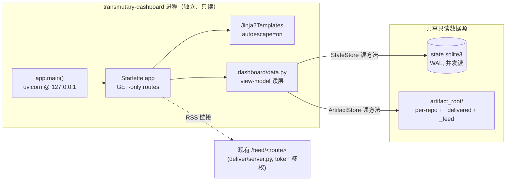

# feat: 只读 Web dashboard（Starlette + Jinja2）

> Status note: this plan records the original read-only dashboard phase. Its
> GET-only/no-write security posture was intentionally superseded by
> `docs/plans/2026-06-01-002-feat-dashboard-promote-ui-plan.md`, which adds
> CSRF-protected promote/demote writes while keeping public binds read-only by
> default.

## Summary

给 transmutary 加一个**本地只读 Web 看板**，让订阅者/观测者在浏览器里看到系统运行态与产出，
无需翻 SQLite 或 artifact 目录。看板**复用现有 Starlette ASGI 栈与 store 读接口**，不碰采集/诊断管线、
不开任何写端点（晋升仍走 CLI——origin 明列「一键晋升按钮，延后，先 CLI」）。

实现这个 origin 需求文档的延后项（§3.2 / §7「Web dashboard（延后）」），作为 Phase B 增量。

数据源：`state.sqlite3`（有效关注清单 / promoted / issue 基线 / star 快照 / token 元数据）
+ `artifact_root` 下已归档报告（per-repo 产物、`_delivered/<route>/`、`_feed/<route>.atom.xml`）。

---

## Problem Frame

当前系统的产出散落在两处，只能命令行/文件系统翻看：

- **运行态**在 `state.sqlite3`：有效关注清单（config ∪ promoted）、各仓 issue 基线、star 快照、
  订阅者 token 元数据——除了 `transmutary list-watchlist`，没有一处能总览。
- **情报产出**在 `artifact_root`：per-repo 诊断/说明报告（`<owner>__<repo>/<ts>-<kind>.md`）、
  按路由投递的渲染件（`_delivered/<route>/`）、私有 RSS（`_feed/<route>.atom.xml`）——只能 `cat`。

订阅者想「打开浏览器看一眼最近出了什么、在盯哪些仓、有没有供应链告警」时，没有可视入口。
本计划补一个只读看板，把已有数据呈现出来——**不产生新数据、不改变任何行为**。

边界硬约束：看板是系统里**第二个**网络面（第一个是 `/feed` 鉴权 feed 服务）。它读的是私有情报
（KTD5：0600/0700、访问受控），所以默认只绑 localhost、凭据/token 不上页、外部仓库内容当不可信数据转义。

---

## Requirements

| ID | 需求 | 来源 |
|----|------|------|
| R-D1 | 总览页展示有效关注清单（config ∪ promoted），每仓标注来源（config / promoted + source） | 用户 · origin R17/F4 |
| R-D2 | 列出最近诊断/说明报告，可点进单篇查看全文 | 用户 · origin R11/R12/R24 |
| R-D3 | 高亮供应链告警（malware/critical → immediate 路由的告警） | 用户 · origin R14/AE3 |
| R-D4 | 展示趋势候选（模式 B 说明报告 + star 快照增速） | 用户 · origin R12/AE4 |
| R-D5 | 展示各仓运行态：issue 基线、star 快照、collect 游标 | 用户 · origin R7/R17 |
| R-D6 | 给出 RSS feed 链接（指向现有 `/feed/<route>` 鉴权端点） | 用户 · origin R14 |
| R-D7 | **只读**：无任何写/变更端点（GET-only），不提供 promote 按钮 | 用户 · origin §3.2/§7 |
| R-D8 | 默认绑 `127.0.0.1`，不公网暴露；非 localhost 绑定显式且告警 | 用户 · KTD5 |
| R-D9 | 凭据（env）与订阅者 token 值绝不渲染到页面 | 用户 · KTD4/R21 |
| R-D10 | 外部仓库内容（issue/release 标题、正文、报告体）渲染时强制转义防 XSS | 用户 · R22/KTD3 web 层延伸 |
| R-D11 | 单篇报告按文件名读取时防路径穿越（reuse `_safe_repo` + 文件名校验） | 用户 · KTD5/R23 |
| R-D12 | 测试全 mock 禁真实网络：复用内存 sqlite + conftest stub + Starlette TestClient | 用户 · 项目测试不变量 |
| R-D13 | README EN + zh 加 dashboard 段；更新状态表 + 路线图（dashboard 已实现，一键晋升仍延后） | 用户 |
| R-D14 | **Host 头校验**：拒绝 Host 不在 localhost allowlist 的请求（防 DNS rebinding 绕过 localhost-bind） | 安全评审 P0-1 |
| R-D15 | URL 上下文 XSS 防护：报告 `sources[].url` 等链接字段进 view model 前校验 scheme 为 http/https，封 `javascript:` href | 安全评审 P0-2 |
| R-D16 | 非 localhost 绑定须显式 `--allow-public` 才放行（否则硬拒），不靠 WARN 兜底；防误配 `0.0.0.0` 静默暴露 | 安全评审 P1-3 |
| R-D17 | 强制 `debug=False` + 通用 500 处理器，错误页不泄漏文件路径/配置/traceback | 安全评审 P1-2 |
| R-D18 | 安全响应头（CSP `default-src 'self'`、`X-Content-Type-Options: nosniff`、`X-Frame-Options: DENY`）纵深防御 | 安全评审 P2-1 |

---

## Key Technical Decisions

### KTD-Dash-1 — 复用 Starlette，不引入 FastAPI

`starlette` + `uvicorn` 已是核心依赖（`pyproject.toml:23-32`），且 `src/transmutary/deliver/server.py`
已是一个 Starlette ASGI app（`make_app(store, feed_source)` + `FeedAuth` + `/feed/{feed}`）。FastAPI 建在
Starlette 之上——再加它是冗余新 Web 框架依赖。dashboard 直接用 Starlette `Route`/`Starlette(routes=...)`，
与现有 feed 服务同栈、同风格。

**Rejected：** FastAPI（冗余、违背「保核心轻」）；Flask（再引一个 WSGI 栈，与现有 ASGI 不一致）。

### KTD-Dash-2 — Jinja2 走可选 `dashboard` extra，autoescape 防 XSS

模板用 Jinja2（`starlette.templating.Jinja2Templates`），**autoescape 默认开**——每个 `{{ }}` 插值自动
HTML 转义，是系统性 XSS 防御，不依赖人工记得包 `escape`（R-D10）。jinja2 放
`[project.optional-dependencies].dashboard`，核心安装不胖；dashboard 模块 import 守卫 jinja2，未装时
console script 报清晰错误（提示 `pip install 'transmutary[dashboard]'`）。

**Rejected：** 手撸字符串模板 + `html.escape`（零依赖，但要求「每个不可信字段都记得手动 escape」，漏一个即
XSS，纪律依赖型、易回归——对安全敏感项目不如 autoescape-by-default 稳）；jinja2 进核心依赖（轻微增胖核心，
与用户「保核心轻」诉求略冲）。

### KTD-Dash-3 — 报告正文以转义纯文本（`<pre>`）呈现，不做 markdown→HTML 渲染

单篇报告体是 `body_md`（markdown，含外部仓内容）。**不**引 markdown 渲染库把它转 HTML——那会重新引入
md 内嵌 HTML 的 XSS 面，且加新依赖。改为在 autoescaped `<pre>` 块里原样显示 markdown 文本：零 XSS 面、
零新依赖、可读性足够（看板是「看一眼」不是排版阅读器）。

**Rejected：** `markdown`/`mistune` 渲染（新依赖 + XSS 面，需配 HTML sanitizer，过重）。

### KTD-Dash-4 — 独立 `transmutary-dashboard` console script，只读进程

新增入口 `transmutary-dashboard`（`transmutary.dashboard.app:main`），独立 uvicorn 进程，复用
`build_runtime` / `StateStore` / `ArtifactStore` 只读接口。与常驻 `transmutary-serve` **解耦**：看板崩不
影响采集调度；service 不跑时也能只看历史产物；两进程经同一 `state_db_path` / `artifact_root` 读同份数据
（SQLite WAL 支持并发读，看板只读不写不抢锁）。

**Rejected：** 嵌入 `transmutary-serve`（单进程跑 scheduler 线程 + uvicorn event loop，耦合更紧、Web 崩
波及调度、service 不跑则无看板）。

### KTD-Dash-5 — 多层访问控制：localhost-bind + Host 头校验 + 显式公网 opt-in；GET-only + 不泄漏

看板默认绑 `127.0.0.1`（R-D8），但 **localhost-bind 是网络层控制，不足以单独防御**——浏览器经 DNS
rebinding 仍能从本机发起请求（TCP 来源合法是 localhost）。故 MVP 三层叠加：

1. **网络层**：默认绑 `127.0.0.1`。
2. **HTTP 层 Host 头 allowlist（R-D14，封 DNS rebinding）**：中间件拒绝 `Host` 不在
   `{127.0.0.1[:port], localhost[:port]}` 的请求（返回 400）。这是 localhost 服务防 rebind 的标准手法。
3. **公网 opt-in 硬门（R-D16）**：非 localhost 绑定**硬拒**，除非操作者显式传 `--allow-public`——
   不靠「WARN 后继续」兜底（一行 log 操作者会漏看，误配 `--host 0.0.0.0` 即静默全网暴露私有情报）。
   显式放行后仍 WARN 并提示应前置鉴权代理。

所有路由 GET-only，无任何 mutation 端点（R-D7）。错误处理强制 `debug=False` + 通用 500 处理器
（R-D17），错误页不泄漏文件路径/配置/traceback。看板层不复刻 `/feed` 的 token 鉴权（feed 是设计给远程
订阅者的；看板是本机运维视图，靠上述三层 + 公网 opt-in 门控）——**完整 token 鉴权**列入延后项，但「公网放行
必须显式」是 MVP 硬门、非延后。

### KTD-Dash-6 — 数据读层与视图分离；凭据/token 永不进视图模型；URL 字段 scheme 校验

新增 `src/transmutary/dashboard/data.py` 视图数据层：组合 `StateStore` 读方法 + `ArtifactStore` 读方法，
产出**纯展示用 dict/dataclass**（view model）。它是唯一允许触达 store 的地方，且**结构性排除**凭据与
token 值——只暴露 feed 路由名/链接、token 的元数据计数（如「N 个有效订阅」），绝不暴露 token/hash/env 凭据
（R-D9）。模板只吃 view model，拿不到 store 句柄。

**URL 上下文 XSS（R-D15）**：autoescape 防的是 HTML 文本上下文，**不**中和 URL 上下文里的
`javascript:` scheme——`<a href="{{ url }}">` 即便 autoescape 也会让 `javascript:alert(1)` 原样可点执行。
故凡进 view model 的链接字段（报告 `sources[].url`、外部仓链接等）由 data.py **校验 scheme 为 http/https**，
否则置空/丢弃。模板渲染 href 只用经此校验的字段。feed 链接是本地相对路径 `/feed/<route>`、不带 token。

---

## High-Level Technical Design

### 组件与数据流



要点：dashboard 进程只读；`data.py` 是唯一 store 触点；模板只见 view model；feed 链接指向**另一个**已存在
的鉴权服务，看板自己不代理 feed 内容。

### 路由表（全 GET）

| 路由 | 视图 | 数据 |
|------|------|------|
| `GET /` | 总览：有效关注清单（标来源）、最近报告、供应链告警高亮、趋势候选、feed 链接 | R-D1/R-D2/R-D3/R-D4/R-D6 |
| `GET /repo/{owner}/{repo}` | 单仓：基线/快照/游标运行态 + 该仓报告列表 | R-D5/R-D2 |
| `GET /report/{owner}/{repo}/{filename}` | 单篇报告全文（autoescaped `<pre>`） | R-D2/R-D10/R-D11 |
| `GET /healthz` | 存活探针（无数据，纯 200） | 运维 |

`{owner}/{repo}` 经 `_safe_repo` 归一化；`{filename}` 校验白名单模式 `^\d+-[a-z-]+\.md$`、拒绝含 `/`/`..`
（R-D11）。

---

## Output Structure

```
src/transmutary/dashboard/
├── __init__.py
├── data.py              # 视图数据读层（StateStore + ArtifactStore → view model）
├── app.py               # Starlette app 构建 + main() 入口（uvicorn）
└── templates/
    ├── base.html        # 布局骨架（autoescape 继承）
    ├── index.html       # 总览
    ├── repo.html        # 单仓运行态
    └── report.html      # 单篇报告（<pre> 转义正文）
tests/
└── test_dashboard.py    # TestClient + 内存 sqlite + 临时 artifact 目录
```

---

## Implementation Units

### U1. ArtifactStore 只读列举/读取接口

**Goal:** 给 `ArtifactStore` 加只读方法，把「列仓 / 列报告 / 读单篇」收口到已管权限与穿越防护的同一处，
供数据层复用（不在别处手撸 `os.listdir`）。

**Requirements:** R-D2, R-D11

**Dependencies:** 无

**Files:**
- `src/transmutary/store/artifacts.py`（扩展，新增读方法）
- `tests/store/test_artifacts.py`（扩展或新增）

**Approach:**
- `list_repos() -> list[str]`：列 `artifact_root` 下的 per-repo 目录，**排除** `_`-前缀目录（`_delivered`、
  `_feed`），把 `owner__repo` 反映射回 `owner/repo`。**反映射结果须再过 `_SAFE_SEGMENT` / `sanitize_repo`
  校验**——若某目录名反映射出穿越段（如 `foo__..` → `foo/..`，可能是旧 bug 或外部工具写入），**排除该条**，
  不让它进 view model / URL（R-D11，防穿越段经 href 外溢）。
- `list_reports(repo) -> list[ReportRef]`：列单仓目录下 `*.md`，解析文件名 `<ts>-<kind>.md` 得
  `(ts, kind, filename)`，按 ts 倒序。`ReportRef` 为轻量 dataclass。
- `read_report(repo, filename) -> str | None`：校验 `filename` 匹配 `^\d+-[a-z-]+\.md$`（拒绝穿越），
  经 `repo_dir()`（已含 containment guard）拼路径读文本；不存在/不合法返回 None。
- 复用现有 `sanitize_repo` / `repo_dir` containment guard；不改写权限逻辑。

**Patterns to follow:** `src/transmutary/store/artifacts.py` 现有 `repo_dir`/`write` 的路径与 guard 风格。

**Test scenarios:**
- `list_repos` 返回 per-repo 目录、**排除** `_delivered`/`_feed`，`owner__repo`→`owner/repo` 正确反映射。
- `list_repos` 空 artifact_root → `[]`。
- `list_reports` 解析 `<ts>-<kind>.md` 正确，按 ts 倒序。
- `read_report` 正常读回写入内容。
- Covers R-D11. `read_report` 传 `../../etc/passwd`、`..%2f`、含 `/` 的文件名 → 返回 None，不读到目录外。
- `read_report` 不存在的文件名 → None（不抛）。
- Covers R-D11. `list_repos` 遇反映射出穿越段的目录名（手工建 `foo__..` 目录）→ 该条被排除，不进返回值。

**Verification:** 新读方法有覆盖；穿越用例确证读不出目录外；现有 artifacts 测试不回归。

---

### U2. dashboard 视图数据读层（`dashboard/data.py`）

**Goal:** 组合 `StateStore` + `ArtifactStore` 只读接口，产出纯展示 view model，结构性排除凭据/token 值。

**Requirements:** R-D1, R-D2, R-D3, R-D4, R-D5, R-D6, R-D9, R-D15

**Dependencies:** U1

**Files:**
- `src/transmutary/dashboard/__init__.py`（新建）
- `src/transmutary/dashboard/data.py`（新建）
- `tests/test_dashboard.py`（新建，本单元覆盖数据层）

**Approach:**
- `build_dashboard_data(settings, store, artifacts)` 等函数，返回 dataclass/dict view model：
  - **有效关注清单**：复用 `service.effective_repos(settings, store)`，每仓标来源——在 config watchlist
    则 `config`，否则 `promoted`（经 `store.is_promoted` / `list_promoted`）。
  - **最近报告**：跨 `artifacts.list_repos()` 汇总 `list_reports`，全局按 ts 倒序，取前 N。
  - **供应链告警**：从报告 kind/severity 过滤（kind 为 advisory/supply-chain 或 severity malware/critical），
    或读 `_delivered/immediate/`。以 kind/severity 判定为准（artifact 是 canonical，R24）。
  - **趋势候选**：kind=trend 的报告 + `store.get_star_snapshots(repo)` 增速。
  - **单仓运行态**：`get_issue_baseline` / `get_star_snapshots` / `get_cursor`。
  - **feed 链接**：构造 `/feed/<route>` 相对链接（immediate/digest），**不**含 token。
- **安全不变量**：本层**绝不**调用 `get_subscriber_token` 返回 token/hash，也不读 env 凭据；token 相关只
  暴露计数类元数据（若需要）。view model 里无 store 句柄、无凭据字段（R-D9）。
- **URL scheme 校验（R-D15）**：凡进 view model 的链接字段（报告 `sources[].url` 等外部 URL）由本层校验
  scheme ∈ {http, https}，否则置空——封 `javascript:`/`data:` 等可点执行 scheme 进 href。`_safe_url(url)`
  辅助函数收口此校验。

**Patterns to follow:** `src/transmutary/service.py:effective_repos`（有效清单算法）；现有 dataclass 风格
（`report/schema.py`）。

**Test scenarios:**
- Covers R-D1. 有效清单含 config 仓 + promoted 仓，来源标注正确（config vs promoted）。
- Covers R-D2. 最近报告跨多仓汇总、全局 ts 倒序、截断到 N。
- Covers R-D3. 一条 malware/critical 报告被归入供应链告警桶；普通诊断不被误归。
- Covers R-D4. trend 报告 + star 快照进趋势候选。
- Covers R-D5. 单仓 view model 含 baseline/snapshot/cursor。
- Covers R-D9. view model 序列化后**不含**任何 token 值/hash、不含 env 凭据字段（断言关键名缺席）。
- Covers R-D15. source 的 url 为 `javascript:alert(1)` / `data:...` → view model 中置空，不作 href；
  正常 `https://` url 保留。
- 空库（无报告、无 promoted）→ view model 各区为空且不抛。

**Verification:** 数据层在内存 sqlite + 临时 artifact 下产出正确 view model；凭据/token 缺席断言通过。

---

### U3. Starlette dashboard app + Jinja2 模板（`dashboard/app.py` + templates）

**Goal:** 构建 GET-only Starlette app 与 autoescape 模板，渲染 view model；jinja2 import 守卫。

**Requirements:** R-D1–R-D7, R-D10, R-D11, R-D14, R-D17, R-D18

**Dependencies:** U2

**Files:**
- `src/transmutary/dashboard/app.py`（新建：`make_dashboard_app(...)` + 路由）
- `src/transmutary/dashboard/templates/base.html`（新建）
- `src/transmutary/dashboard/templates/index.html`（新建）
- `src/transmutary/dashboard/templates/repo.html`（新建）
- `src/transmutary/dashboard/templates/report.html`（新建）
- `tests/test_dashboard.py`（扩展：路由/渲染/XSS）

**Approach:**
- `make_dashboard_app(settings, store, artifacts) -> Starlette`：注册 `/`、`/repo/{owner}/{repo}`、
  `/report/{owner}/{repo}/{filename}`、`/healthz`，全 GET。**硬编码 `debug=False`**（R-D17）。
- 模板经 `starlette.templating.Jinja2Templates(directory=templates)`，**autoescape 默认开**。
- jinja2 import 守卫：`app.py` 顶层 try-import jinja2/Jinja2Templates，缺失时 `make_dashboard_app`/`main`
  抛带提示的 `RuntimeError`（`pip install 'transmutary[dashboard]'`）。
- 报告正文：`report.html` 把 `body_md` 放进 `<pre>{{ body }}</pre>`，靠 autoescape 转义（KTD-Dash-3）。
- `{owner}/{repo}` → `sanitize_repo`；`{filename}` 校验，非法 → 404；报告不存在 → 404。
- **Host 头中间件（R-D14）**：拒绝 `Host` 不在 `{127.0.0.1[:port], localhost[:port]}` allowlist 的请求 →
  400，防 DNS rebinding。allowlist 在 app 构建时按绑定 host/port 生成（公网 opt-in 时相应放宽）。
- **安全响应头中间件（R-D18）**：每个响应加 `Content-Security-Policy: default-src 'self'`、
  `X-Content-Type-Options: nosniff`、`X-Frame-Options: DENY`。
- **通用 500 处理器（R-D17）**：`exception_handlers={500: ...}` 返回通用文案，不含异常详情/路径。
- app 构建不绑端口/不起 server（纯 ASGI 对象，便于 TestClient 注入）。

**Patterns to follow:** `src/transmutary/deliver/server.py`（`make_app` 工厂 + `Route` + 404-不泄漏风格）。

**Test scenarios:**
- Covers R-D1. `GET /` 200，页面含有效清单各仓名与来源标注。
- Covers R-D2. `GET /` 含最近报告链接；`GET /report/.../<file>` 200 显示正文。
- Covers R-D10（关键 XSS 回归）：注入 `<script>alert(1)</script>` 标题/正文的报告，渲染后页面含
  `&lt;script&gt;` 转义形式、**不**含可执行 `<script>` 原文。
- Covers R-D15. 报告 source 含 `javascript:` url → 渲染后页面无 `href="javascript:`（已被 data 层置空）。
- Covers R-D11. `GET /report/o/r/..%2f..%2fetc%2fpasswd` 与非法文件名 → 404，不读目录外。
- Covers R-D7. app 路由表无非 GET 方法；无 promote/任何 mutation 端点（断言路由方法集 ⊆ {GET}）。
- Covers R-D14. `Host: attacker.com` 请求 → 400；`Host: 127.0.0.1:8787` / `localhost` → 放行。
- Covers R-D18. 任一响应含 `Content-Security-Policy`、`X-Content-Type-Options: nosniff`、`X-Frame-Options`。
- Covers R-D17. 触发内部错误的路由（注入抛异常的 stub）→ 响应体不含文件路径/异常类名/traceback。
- Covers R-D9. 渲染后 HTML 的 feed `<a href>` 不含 `token`/`Bearer` 子串。
- `GET /repo/{owner}/{repo}` 未知仓 → 404 或空态（择一，测试锁定）。
- `GET /healthz` → 200。
- jinja2 缺失时 `make_dashboard_app` 抛带安装提示的 RuntimeError（monkeypatch 模拟 ImportError）。

**Verification:** TestClient 全路由用例通过；XSS 回归确证转义；路由 GET-only 断言通过；jinja2 守卫生效。

---

### U4. `transmutary-dashboard` 入口 + pyproject 接线

**Goal:** 加 `main()` 入口（uvicorn @ localhost）与 console script + `dashboard` extra；公网绑定显式 opt-in 硬门。

**Requirements:** R-D8, R-D16, R-D13（pyproject 部分）

**Dependencies:** U3

**Files:**
- `src/transmutary/dashboard/app.py`（加 `main()`）
- `pyproject.toml`（`[project.scripts]` + `[project.optional-dependencies].dashboard`）
- `tests/test_dashboard.py`（扩展：host 默认 / 非 localhost 告警，可单测 arg 解析）

**Approach:**
- `main()`：读 `TRANSMUTARY_CONFIG_DIR`（默认 `config`，与 `service.main` 一致）→ `load_settings` →
  `build_runtime`（或直接构造只读 StateStore + ArtifactStore）→ `make_dashboard_app` →
  `uvicorn.run(app, host=..., port=...)`。
- host 默认 `127.0.0.1`，port 默认（如 8787）。host/port 可经 env 或 argparse 覆盖。
- **公网 opt-in 硬门（R-D16）**：非 localhost host **硬拒**（抛错/退出并提示），除非显式传 `--allow-public`；
  显式放行后仍 `logger.warning` 提示应前置鉴权代理。不靠「WARN 后继续」——防误配 `0.0.0.0` 静默暴露。
- pyproject：`transmutary-dashboard = "transmutary.dashboard.app:main"`；
  `[project.optional-dependencies] dashboard = ["jinja2"]`。
- `main()` 标 `# pragma: no cover`（真起 server），但绑定决策抽成可测纯函数
  （`resolve_bind(host, port, allow_public) -> (host, port)` 或抛 `SystemExit`/`ValueError`）单测。

**Patterns to follow:** `src/transmutary/service.py:main`（config_dir env + load_settings 模式）；
`pyproject.toml` 现有 `[project.scripts]` 三入口。

**Test scenarios:**
- `resolve_bind` 无覆盖 → `127.0.0.1` + 默认 port，正常返回。
- Covers R-D16. `resolve_bind` 传 `0.0.0.0` / 非 localhost 且 **无** `--allow-public` → 硬拒（抛 SystemExit/
  ValueError），不返回绑定。
- Covers R-D16. `resolve_bind` 传 `0.0.0.0` + `--allow-public` → 放行返回该 host（行为可断言 + WARN 发出）。
- console script entry 字符串指向 `transmutary.dashboard.app:main`（可经 importlib 解析断言，或 pyproject 解析）。

**Verification:** `resolve_bind` 默认 localhost；非 localhost 无 `--allow-public` 硬拒、有则放行+WARN 用例
通过；`pip install '.[dashboard]'` 后 `transmutary-dashboard` 可解析为入口。

---

### U5. 文档：README EN + zh + 路线图/状态更新

**Goal:** README 双语加 dashboard 段；更新状态表与路线图（dashboard 已实现、一键晋升仍延后）；同步测试数。

**Requirements:** R-D13

**Dependencies:** U4

**Files:**
- `README.md`（新增 dashboard 段 + 状态表/路线图 + 测试数）
- `README.zh-CN.md`（对应中文段）
- `CONTEXT.md`（视需要：dashboard 进 词汇表/架构指针）

**Approach:**
- 新增「Dashboard」段（EN）/「看板」段（zh）：一句定位（本地只读看板）+ 启动命令
  （`pip install '.[dashboard]'` → `transmutary-dashboard` → 浏览器开 `http://127.0.0.1:8787`）+ 安全说明
  （默认 localhost、只读、不开 promote、外部内容转义）。
- 状态表加一行：`Phase B — read-only web dashboard | ✅ done`。
- 路线图：把「web dashboard」从延后移除，**保留**「一键晋升按钮（UI）」仍延后（origin §7）。
- 测试数徽章/段落按 U1–U4 新增用例后的实际数刷新（实现完成后填真实数，勿臆测）。

**Patterns to follow:** README 现有「Deployment / 部署」「Promotion / 晋升」段的双语结构与风格。

**Test expectation:** none —— 纯文档单元，无行为变更。

**Verification:** 双语 dashboard 段齐全、命令可照抄；状态表/路线图反映 dashboard 已实现且一键晋升仍延后；
测试数与实际一致。

---

## Scope Boundaries

### In scope
- 只读 Starlette + Jinja2 看板：总览、单仓运行态、单篇报告查看、供应链告警高亮、趋势候选、feed 链接。
- 独立 `transmutary-dashboard` 入口（localhost-default）+ `dashboard` 可选 extra。
- ArtifactStore 只读列举/读取接口 + 视图数据层 + 模板 + 测试 + 双语文档。

### Deferred to Follow-Up Work
- **看板写能力 = 紧接的第二个计划**（用户 2026-05-31 决策「只读本轮 + 写下轮」）：promote/demote UI
  （origin F4「一键晋升按钮」）。**必须带独立威胁模型**——一旦开 POST 端点，本计划的「GET-only 免 CSRF +
  localhost-bind 防 rebind」前提全失效，需新增：CSRF token、写端点真鉴权（localhost 对写操作不足）、
  输入校验、确认流。故**不**塞进本只读计划，单独成计划/PR，安全设计不混。
- 看板层的**完整 token 鉴权**（当前访问控制 = localhost-bind + Host 头校验 + 公网 opt-in 硬门；公网放行后
  的远程鉴权需自行前置鉴权代理）。注：「公网放行必须显式 `--allow-public`」是 MVP 硬门、**非**延后。
- 自动刷新 / SSE / WebSocket 实时更新（当前为请求时快照）。
- 分页 / 搜索 / 过滤（当前固定取最近 N）。
- 经 Web 编辑 `watchlist.yaml` / `trend_scope.yaml`（Web 写配置文件风险最高，写坏可致 service 起不来；
  CLI + 文件编辑已覆盖，收益/风险比差，更靠后再议）。

### Outside this product's identity（origin §7，保持延后）
- 订阅自助配置（self-serve）、多租户隔离、付费数据源。

---

## Risks & Dependencies

| 风险 | 影响 | 缓解 |
|------|------|------|
| 私有情报经 Web 暴露（误配公网） | 高 | localhost-default（KTD-Dash-5）+ 非 localhost **硬拒除非 `--allow-public`**（R-D16）+ GET-only |
| DNS rebinding 绕过 localhost-bind | 高 | Host 头 allowlist 中间件 → 400（R-D14）+ 专项测试 |
| XSS（HTML 文本上下文，外部仓内容） | 高 | Jinja2 autoescape（KTD-Dash-2）+ 正文 `<pre>` 不转 HTML（KTD-Dash-3）+ XSS 回归测试 |
| XSS（URL 上下文，`javascript:` href） | 高 | data 层 URL scheme allowlist 校验（R-D15/KTD-Dash-6）+ 专项测试 |
| 路径穿越（report 文件名 / 目录反映射） | 中 | 文件名白名单正则 + containment guard + 反映射再校验（U1/R-D11）+ 穿越用例测试 |
| 凭据/token 误上页 | 高 | 数据层结构性排除（KTD-Dash-6）+ 缺席断言 + feed href 无 token 测试（R-D9） |
| 错误页泄漏路径/配置/traceback | 中 | 强制 `debug=False` + 通用 500 处理器（R-D17）+ 错误页脱敏测试 |
| 响应缺纵深防御头 | 低 | CSP/`nosniff`/`X-Frame-Options` 中间件（R-D18）+ 响应头测试 |
| jinja2 未装致启动失败 | 低 | import 守卫 + 带安装提示报错（KTD-Dash-2） |
| 看板与 service 并发读 SQLite | 低 | WAL 已启用；看板只读不写、不抢写锁（KTD-Dash-4） |

**Dependencies:** 无新核心依赖（starlette/uvicorn 已在核心）；仅 `dashboard` extra 引入 `jinja2`。

---

## Acceptance Examples

- **AE-D1**：装 `'.[dashboard]'` → 跑 `transmutary-dashboard` → 浏览器开 `127.0.0.1:8787` → 总览页列出
  有效关注清单（config + promoted，标来源）、最近报告、供应链告警、趋势候选、feed 链接。
- **AE-D2**：点一条报告 → 单篇页显示全文；报告标题/正文含 `<script>` → 页面显示转义文本、脚本不执行。
- **AE-D3**：构造 `/report/o/r/..%2f..%2fetc%2fpasswd` 请求 → 404，读不到目录外。
- **AE-D4**：page source / view model 中检索任何 env 凭据或订阅者 token 值 → 不存在；feed href 不含 token。
- **AE-D5**：以 `--host 0.0.0.0` **不带** `--allow-public` 启动 → 硬拒退出（非仅 WARN）；带 `--allow-public`
  则放行并打公网暴露 WARN。
- **AE-D6**：看板进程运行中，`transmutary-serve` 同时写产物 → 看板只读不报错、刷新可见新产物。
- **AE-D7**：带 `Host: evil.com` 头请求 `/` → 400（DNS rebinding 被 Host allowlist 拦截）。
- **AE-D8**：报告 source 含 `javascript:alert(1)` url → 报告页无 `href="javascript:`，scheme 被 data 层置空。

---

## Sources & Research

- Origin 需求：`docs/brainstorms/2026-05-29-repo-observation-system-requirements.md`（§3.2/§7 dashboard 延后；
  「一键晋升按钮，延后，先 CLI」）。
- 现有 ASGI 栈：`src/transmutary/deliver/server.py`（`make_app` + `FeedAuth` + `/feed/{feed}`，404-不泄漏）。
- store 读接口：`src/transmutary/store/state.py`（`list_promoted`/`is_promoted`/`get_issue_baseline`/
  `get_star_snapshots`/`get_cursor`/`get_subscriber_token`）；`src/transmutary/store/artifacts.py`
  （`repo_dir`/`_safe_repo`/`_safe_repo_guard`/`_render_markdown`）。
- 运行时缝：`src/transmutary/pipeline.py:build_runtime`（`store`/`artifacts`/`settings` 注入）；
  `PipelineRuntime` 字段。
- 有效清单算法：`src/transmutary/service.py:effective_repos`。
- 配置字段：`src/transmutary/config.py` Delivery（`state_db_path`/`artifact_root`/`feed_dir`/`digest_hour`）。
- 测试基建：`tests/conftest.py`（`_no_real_embeddings`/`fake_env`/`config_dir` autouse）；
  `tests/test_service.py`（内存 sqlite + runtime 构造范式）。
- 依赖现状：`pyproject.toml`（starlette/uvicorn 已核心；三 console script；dev/build extra）。
- **plan 级安全评审（load-bearing，2026-05-31）**：ce-security-lens-reviewer 对本计划出 7 条，已全部合入——
  P0 DNS rebinding（→ R-D14 Host 头校验）、P0 `javascript:` href（→ R-D15 URL scheme 校验）、
  P1 目录反映射穿越（→ U1 再校验）、P1 错误页泄漏（→ R-D17 debug=False+500 处理器）、
  P1 公网误配静默暴露（→ R-D16 显式 opt-in 硬门，从延后升为 MVP 硬门）、P2 安全响应头（→ R-D18）、
  P2 feed href 无 token 测试（→ U3 测试场景）。
