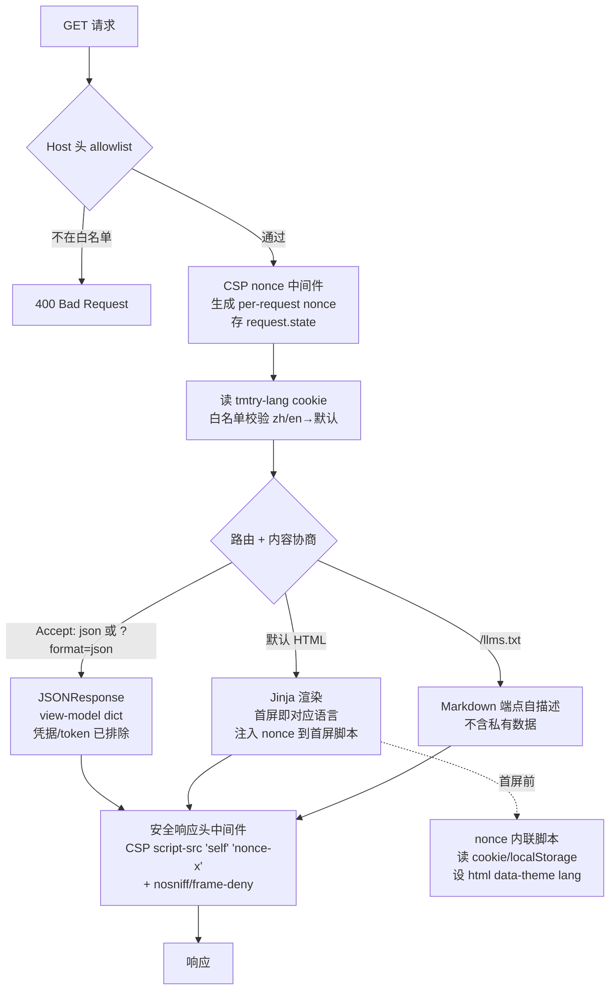

# feat: Dashboard 现代化重做（v2 UI + i18n + agent-native + a11y）

> Status note: this plan records the dashboard v2 UI phase before write
> endpoints. Its read-only/GET-only assumptions were intentionally superseded by
> `docs/plans/2026-06-01-002-feat-dashboard-promote-ui-plan.md`, which adds
> CSRF-protected promote/demote writes while keeping JSON/data endpoints
> read-only.

## Summary

给已交付的只读 Web 看板（`transmutary-dashboard`，当前 v0.9.0）做一次现代化重做：调研收敛的现代
UI（侧边栏 + stat tiles + Sentry issue-stream 告警 + severity 三通道编码 + 亮暗双主题）、界面中英可切换
（含服务端 cookie 渲染消除首屏英文）、a11y/ARIA、以及 agent-native 出口（`/llms.txt` + JSON content
negotiation）。

引入两块新基础设施：**CSP nonce 中间件**（让 `<head>` 首屏脚本在首次绘制前设主题/语言，根除 FOUC，同时
不放松 CSP——nonce 是精确放行）和 **cookie 语言协商**（服务端 Jinja 首屏即出对应语言）。全程守住既有安全
不变量（只读、GET-only、localhost-bind + Host 头、凭据/token 不上页、XSS 转义），并把这些保证扩展到新增
的 JSON 出口。

延续前序只读 dashboard 计划（见 predecessor）；**写能力（promote UI）仍不在本轮**。

---

## Problem Frame

v0.9.0 看板功能完整、安全、已发布，但用户在真实使用中提出两点缺口，且引出第三点：

1. **设计不够现代**。当前是最小化手写 CSS——等宽字、灰边框表格、基础 severity 着色。用户要「更现代」。
   已做 web 调研（2026 运维/监控 dashboard 趋势）+ 给用户看过高保真 demo 并确认方向。
2. **没有中文**。界面全英文。用户要中文化,且进一步要「可切换」(中/英用户可选)。
3. **首屏/无 JS 英文 + 主题闪屏（FOUC）**。一旦做客户端语言/主题切换,纯客户端方案会在首屏闪一下
   英文/亮色再跳——在 CSP `default-src 'self'` 下,消除它需要受控的 nonce 内联脚本,这是本轮最硬的架构点。

附带,趁这次 Web 层重做,补上 origin 一直倡导但 dashboard 尚未落地的 **agent-native parity**
（用户能在 UI 看到的,agent 也能机器可读地拿到）——低成本、契合「观测系统」定位。

边界:这是**增强**,不是重写。复用现有 `data.py` view-model 读层、`store` 读接口、安全中间件骨架;
只读、GET-only、零写端点的根本性质不变。

---

## Requirements

| ID | 需求 | 来源 |
|----|------|------|
| R-V1 | 现代视觉：侧边栏布局 + 顶部 stat tiles + Sentry issue-stream 告警行 + 卡片化 | 用户 · web 调研 |
| R-V2 | severity 三通道编码：色（左 3px 条）+ SVG 图标（盾/三角/圆）+ 文字 pill；不只靠颜色 | 用户 · WCAG 2.2 |
| R-V3 | GitHub Primer/Radix 亮暗双色板；无玻璃拟态/无渐变/无全员阴影（调研指认反模式） | web 调研 |
| R-V4 | tabular-nums 数字右对齐、行 hover、响应式（窄屏侧栏降级） | web 调研 |
| R-T1 | 明暗主题三态切换（亮/暗/系统）+ localStorage 记忆 + 手动切换按钮 | 用户 |
| R-T2 | 主题无 FOUC：首屏首次绘制前即应用（cookie/localStorage） | 用户 |
| R-I1 | 界面 chrome 中英可切换（data-i18n 标记 + JS 字典 + 用户可切 + 记忆） | 用户 |
| R-I2 | 数据内容（repo 名/severity/kind/报告标题/正文）保持原文不翻 | 用户 |
| R-I3 | 服务端语言：cookie 存语言，Jinja 首屏即渲染对应语言（消除首屏/无JS 英文） | 用户 |
| R-I4 | cookie 语言值白名单校验（仅 zh/en），怪值→默认，防 cookie 注入入渲染 | 安全 |
| R-E1 | 空态安心提示（无告警→绿勾「无供应链告警」而非干巴 No alerts） | 用户 |
| R-E2 | 长区块 `<details>` 折叠（纯 HTML 零 JS） | 用户 |
| R-A1 | a11y：severity `aria-label`、表格 `scope`、焦点态、键盘可达、`<html lang>` 随语言切 | 用户 · WCAG 2.2 |
| R-G1 | `GET /llms.txt`：机器可读 Markdown 描述只读端点结构，不含私有数据 | 用户 · agent-native |
| R-G2 | JSON 出口：现有 GET 路由支持 `Accept: application/json` 或 `?format=json` 返回 view-model JSON | 用户 · agent-native |
| R-C1 | **CSP nonce 中间件**：per-request nonce，`script-src 'self' 'nonce-xxx'`，不开 unsafe-eval/inline、不放外域 | 安全 · R-T2 |
| R-C2 | nonce per-request 唯一 + 不可缓存；FOUC 内联脚本必须带当次 nonce | 安全 |
| R-S1 | 既有安全不变量全保持：只读/GET-only/Host 头 allowlist/公网硬门/debug=False 不泄漏/安全响应头 | 继承 |
| R-S2 | JSON 出口复用 HTML 路径同一凭据/token 排除保证，不新开绕过排除的数据路径；仍受 Host 头 + GET-only 约束 | 安全 |
| R-S3 | 零 Node 构建链、零外部 CDN、零外部字体；vanilla JS 自托管同源，不引 Alpine/框架 | 继承 · 离线基调 |
| R-S4 | package-data 打包新增静态资源（templates/*.html + static/*.css + static/*.js），防 pip install 丢失 | 继承 |

---

## Key Technical Decisions

### KTD-V1 — vanilla JS 自托管，不引 Alpine.js

主题切换 + 语言切换 + 折叠交互用**手写 vanilla JS**（同源 `static/dashboard.js`），不引 Alpine。
调研结论（best-practices 研究）：Alpine CSP build 60KB 且**省不掉写 JS**——主题切换要 `localStorage`/
`matchMedia`、语言要 DOM 遍历,这些在 Alpine CSP build 里都禁内联、必须写进 `Alpine.data()` JS。对只读
看板「主题+语言+折叠」需求,vanilla（~80-120 行）CSP 最干净（`script-src 'self'`、零 eval）、零 60KB
依赖。Alpine 只在「多互依赖响应式组件」才值回票价,本轮用不上。

**Rejected:** Alpine.js CSP build（60KB + 指令语法限制,收益不抵成本）；引 CDN 框架（破 CSP + 离线基调）。

### KTD-V2 — CSS 体系：GitHub Primer 语义色 + Radix 灰阶思路，CSS 变量驱动亮暗

色板用 GitHub Primer 派生的语义 token（亮 `#ffffff/#f6f8fa`、暗 `#0d1117/#161b22`）+ severity 语义色
（critical 红 / high 橙 / info 蓝,亮暗各一套）。亮暗经 `[data-theme]` 属性 + `@media (prefers-color-
scheme)` 双轨：`:root` 默认亮、`@media dark` 在无显式 `[data-theme="light"]` 时跟随系统、`[data-theme=
"dark"]` 显式覆盖。无玻璃拟态/渐变/全员阴影——层次靠 1px 边框 + 2-3% 亮度差（调研指认 2024-2025 反模式）。

### KTD-V3 — severity 三通道编码（色 + 图标 + 文字），WCAG 2.2 非文本对比

severity 不只靠颜色（色盲不友好）。每条告警三通道叠加：3px 左色条 + inline SVG 图标（盾=critical/
三角=high/圆=info,同源 SVG 不引图标库）+ 文字 pill（CRITICAL/HIGH/INFO）。色条/徽章对比满足 WCAG 2.2
非文本 3:1。SVG 内联进模板（受信任静态标记,非外部数据）。

### KTD-C1 — CSP nonce 中间件取代静态 CSP（精确放行，非放松）

现状 `Content-Security-Policy: default-src 'self'`（静态字符串）。FOUC 修复需 `<head>` 内联脚本在首屏
前读 cookie/localStorage 设主题/语言——内联脚本撞 `'self'`。正解:加 Starlette CSP 中间件,**每请求**
生成随机 nonce（`secrets.token_urlsafe`）,注入 `request.state` 供模板用,并设
`script-src 'self' 'nonce-<x>'`。这是**精确放行**单个受信任内联脚本——**不**开 `unsafe-inline`/
`unsafe-eval`、**不**放外域。nonce per-request 唯一、随响应即时生成、绝不缓存（R-C2）。

替代过的方案:**hash**（静态脚本算 sha256 进 CSP）——更适合可缓存页,但本看板是动态私有视图、无缓存层,
nonce 更直接且与 cookie 语言（本就 per-request）一致。**降级（仅 prefers-color-scheme 跟随系统）**——
零 nonce 但放弃手动主题/语言持久,与用户「可切换」诉求冲突,弃。

**安全注记:** 引 nonce 后 CSP 比现状**更严**（现状 `default-src 'self'` 隐式允许同源内联?否——
`default-src 'self'` 本就不允许内联脚本,现状无内联脚本故无碍）。新 CSP 显式拆 `script-src 'self'
'nonce-x'` + 其余 `default-src 'self'`,内联脚本仅凭当次 nonce 通过,安全姿态不降反升。

### KTD-I1 — 双层 i18n：服务端 cookie 渲染（首屏）+ 客户端 JS 切换（无刷新）

i18n 两层协作消除首屏英文:
1. **服务端**:语言存 cookie（`tmtry-lang`,白名单 zh/en,R-I4 校验,怪值→默认）。Jinja 渲染时读 cookie,
   首屏 HTML 即出对应语言文案 + `<html lang>` 正确。无 JS 也对。
2. **客户端**:`static/dashboard.js` 提供切换按钮,点击→写 cookie + 即时 DOM 遍历替换 `data-i18n` 文案 +
   改 `<html lang>`,无需刷新。下次请求服务端凭 cookie 首屏即对。

文案字典两份（zh/en）同时存在于**服务端 Jinja**（首屏用）与**客户端 JS**（切换用）——单一真相源放
一处 Python dict,JS 字典由它生成或镜像（实现时择一,计划不锁死;关键是两边不漂移,加测试断言键集一致）。
数据内容（repo/severity/kind/标题/正文）永不进字典——只翻 chrome（R-I2）。

**cookie 属性（安全评审 P2）**：`tmtry-lang` cookie 写入须带 `SameSite=Strict; Path=/`（纯同源 UI 偏好,
跨站提交无意义,Strict 更稳）；**不**设 `HttpOnly`（JS 需读写）；**不**设 `Secure`（localhost HTTP 为主;
若日后 `--allow-public` 经 HTTPS 部署再议）。JS `document.cookie` 写时显式带这些属性。

### KTD-I2 — 语言/主题首屏状态：cookie（语言，服务端需要）+ localStorage（主题，纯客户端）

语言走 **cookie**（服务端渲染要读）+ localStorage 镜像（客户端切换快）。主题走 **localStorage**
（纯展示、服务端不需知道主题即可渲染——CSS 变量 + `@media` 已能跟随系统;手动覆盖由首屏 nonce 脚本读
localStorage 设 `[data-theme]`）。FOUC 内联脚本同时处理两者:读 cookie/localStorage,首屏前设
`<html data-theme lang>`。

### KTD-G1 — JSON 出口走 content negotiation，复用 data 层，零新数据路径

agent-native JSON 出口**不**新开数据路径——同一 view-model builder（`build_overview` 等）的输出
序列化为 JSON。路由按 `Accept: application/json` 头 **或** `?format=json` 查询参数分支:命中则返回
`JSONResponse(view_model_as_dict)`,否则现状 HTML。**关键安全保证（R-S2）:** JSON 出口经过与 HTML
完全相同的 view-model——凭据/token 的结构性排除（既有 KTD-Dash-6）一次保证两路覆盖,不存在「JSON 绕过
排除」的可能。JSON 出口仍受 Host 头 allowlist + GET-only + 公网硬门约束（同 app 同中间件）。

### KTD-G2 — `/llms.txt` 仅描述端点结构，不含私有数据

`GET /llms.txt` 返回静态/半静态 Markdown:描述这是什么系统、有哪些只读端点、各端点返回什么、如何用
`Accept: json` 拿结构化数据。**不含**实际私有数据（不列真实 repo 清单、不含报告内容）——纯 API 自描述,
类似 robots.txt 之于爬虫。media_type `text/plain` 或 `text/markdown`。

---

## High-Level Technical Design

### 请求流（含 nonce + cookie 语言 + content negotiation）



### 中间件栈次序（关键——nonce 须在路由前生成、CSP 头在响应时带 nonce）

```
外层 → 内层:
  ServerErrorMiddleware (Starlette 内置最外,catch 500)
  HostAllowlistMiddleware        (R-D14,最先拒非法 Host)
  CSPNonceMiddleware             (生成 nonce 存 request.state；响应时写 CSP 头带 nonce)
  [路由处理：HTML / JSON / llms.txt]
```
注:现状 `SecurityHeadersMiddleware` 的 CSP 职责并入 `CSPNonceMiddleware`（CSP 头需带 per-request
nonce,不能再是静态字符串）;nosniff/frame-deny/referrer 仍静态。500 处理器仍须手挂安全头（含一个无
nonce 的保守 CSP,因错误页无内联脚本）。

### severity 三通道（每条告警行）

```
┌─┬──┬─────────┬────────────────────────────────┐
│▌│🛡 │ CRITICAL│ Malicious release in acme/cli  │  ← ▌=3px左色条  🛡=SVG图标  CRITICAL=文字pill
└─┴──┴─────────┴────────────────────────────────┘
   三通道 = 色 + 形状 + 文字,任一通道单独可辨（色盲/灰度/屏幕阅读器各覆盖）
```

---

## Output Structure

```
src/transmutary/dashboard/
├── app.py              # 改：加 CSPNonceMiddleware、cookie 语言、content negotiation、/llms.txt、/static/dashboard.js 路由
├── data.py             # 改：view-model 加 to_dict / JSON 序列化（凭据排除复用）
├── i18n.py             # 新：服务端文案字典（zh/en）+ 语言解析/校验（白名单）
├── llms.py             # 新：/llms.txt 内容生成（端点自描述，无私有数据）
├── static/
│   ├── dashboard.css   # 重写：现代设计体系（Primer/Radix 色板、stat tiles、stream、三通道）
│   └── dashboard.js    # 新：vanilla JS（主题三态切换 + 语言切换 + 折叠 + 首屏 FOUC 逻辑分离）
└── templates/
    ├── base.html       # 改：侧边栏布局、nonce 首屏脚本、<html lang/data-theme>、i18n data-* 标记、a11y
    ├── index.html      # 改：stat tiles、issue-stream 告警、三通道、空态、<details>、i18n 标记
    ├── repo.html       # 改：现代化 + i18n + a11y
    └── report.html     # 改：现代化 + i18n + a11y
tests/
└── test_dashboard.py   # 扩展：nonce、cookie 语言、JSON 出口、llms.txt、i18n 字典一致、a11y 标记、空态
```

---

## Implementation Units

### U1. CSP nonce 中间件 + 安全头整合

**Goal:** 用 per-request nonce 的 CSP 中间件取代静态 CSP，让首屏内联脚本可受控放行，不放松 CSP。

**Requirements:** R-C1, R-C2, R-S1（保持其余安全头）

**Dependencies:** 无

**Files:**
- `src/transmutary/dashboard/app.py`（改：新增 `CSPNonceMiddleware`，CSP 职责从 `SecurityHeadersMiddleware` 迁入）
- `tests/test_dashboard.py`（扩展）

**Approach:**
- `CSPNonceMiddleware`：每请求 `secrets.token_urlsafe(16)` 生成 nonce（128-bit 熵，足够），存
  `request.state.csp_nonce`；响应时设
  `Content-Security-Policy: default-src 'self'; script-src 'self' 'nonce-<x>'; style-src 'self'`
  （style 仍同源 css；不开 unsafe-inline/eval；不放外域）。
- **nonce fail-closed（安全评审 P0）**：若渲染时 `request.state.csp_nonce` 缺失/为空（中间件未跑/栈序错），
  模板**不得**输出 `nonce=""` 属性、CSP 头**不得**带 `'nonce-'` 空 token——回落 `script-src 'self'`（拦掉
  内联脚本，fail-closed）。空 nonce + `'nonce-'` 在部分浏览器会让 nonce 检查失效（CSP 静默失效），故必须
  fail-closed 而非 fail-open。模板用 `nonce="{{ nonce }}"`，CSP 头仅在 nonce
  非空时拼 token。
- nosniff / X-Frame-Options / Referrer-Policy 保持静态（可留在 SecurityHeadersMiddleware 或并入）。
- 500 处理器:错误页无内联脚本,挂一个**无 nonce** 的保守 CSP（`default-src 'self'`）+ 其余安全头（R-S1）。
- 模板经 `request.state.csp_nonce` 拿 nonce（context 注入或 `request` 直接可达）。

**Patterns to follow:** 现有 `SecurityHeadersMiddleware` / `server_error` 处理器（app.py）；
`deliver/server.py` 的中间件风格。

**Test scenarios:**
- Covers R-C2. 同一 app 连发两请求 → 两个**不同** nonce（per-request 唯一）。
- 响应 CSP 头含 `script-src 'self' 'nonce-<那次的值>'`，且 nonce 与 `request.state` 一致。
- CSP **不含** `unsafe-inline`、`unsafe-eval`、外域。
- **nonce fail-closed（P0）**：模拟 `request.state.csp_nonce` 缺失/空 → 渲染的脚本标签**无** `nonce`
  属性，CSP 头**不含** `nonce-` token（回落 `script-src 'self'`，拦内联脚本，非 fail-open）。
- 500 错误响应仍带安全头 + 一个不含 nonce 的保守 CSP（不泄漏 + R-S1）。
- nosniff / X-Frame-Options / Referrer-Policy 仍在每个响应。

**Verification:** 每响应带唯一 nonce CSP；无 unsafe-*；500 仍安全；既有安全头测试不回归。

---

### U2. 服务端 i18n：cookie 语言协商 + 文案字典

**Goal:** 加服务端语言层——cookie 读取 + 白名单校验 + zh/en 文案字典，Jinja 首屏即出对应语言。

**Requirements:** R-I1, R-I3, R-I4, R-I2（数据不翻）

**Dependencies:** 无

**Files:**
- `src/transmutary/dashboard/i18n.py`（新）
- `src/transmutary/dashboard/app.py`（改：路由读 cookie→lang，传入模板 context）
- `tests/test_dashboard.py`（扩展）

**Approach:**
- `i18n.py`：`MESSAGES = {"en": {...}, "zh": {...}}` 单一真相源（仅 UI chrome 文案：nav/区块标题/列头/
  按钮/空态/只读徽章等）；`resolve_lang(cookie_value) -> "en"|"zh"`（白名单校验，非 zh/en 一律→默认 en
  或按 Accept-Language 推断，实现时定，默认安全）。
- app.py 路由：读 `tmtry-lang` cookie → `resolve_lang` → 把 `lang` + `t`(该语言字典) 传入每个
  `TemplateResponse` context。
- 模板用 `{{ t['nav.overview'] }}` 形式（或 `data-i18n` + 服务端首屏填充，二选一，KTD-I1）。
- 数据字段（repo/severity/kind/title/body）**不**经字典——R-I2。

**Patterns to follow:** 现有 `make_dashboard_app` 的 context 传递（`{"overview": ...}`）。

**Test scenarios:**
- Covers R-I3. cookie `tmtry-lang=zh` → 首屏 HTML 含中文 chrome（如「总览」「供应链告警」）。
- cookie `tmtry-lang=en` 或缺失 → 英文 chrome。
- Covers R-I4. cookie `tmtry-lang=<script>`/`fr`/超长怪值 → 不报错，回落默认语言，怪值**不**进渲染。
- Covers R-I2. zh 渲染下 repo 名 `acme/cli`、severity `critical`、报告标题仍原文，未被翻译。
- `<html lang>` 随 cookie 语言为 `zh-CN` / `en`。
- 字典键集一致：en 与 zh 的 key 集合相等（无漏译键）——断言 `set(en) == set(zh)`。

**Verification:** cookie 驱动首屏语言；白名单挡怪值；数据不翻；键集一致。

---

### U3. 现代 CSS 设计体系（重写 dashboard.css）

**Goal:** 落地调研收敛的现代视觉——侧边栏、stat tiles、issue-stream、severity 三通道、Primer/Radix
亮暗色板。

**Requirements:** R-V1, R-V2, R-V3, R-V4, R-T1（主题 CSS 变量）

**Dependencies:** 无（纯 CSS，但与 U5 模板类名约定对齐）

**Files:**
- `src/transmutary/dashboard/static/dashboard.css`（重写）
- `tests/test_dashboard.py`（扩展：css 同源仍可服务 + 含关键类）

**Approach:**
- CSS 变量驱动亮暗：`:root` 亮 + `@media (prefers-color-scheme: dark) :root:not([data-theme="light"])`
  跟随系统 + `[data-theme="dark"]` 显式覆盖（KTD-V2）。
- 布局:CSS grid 侧边栏（~220px）+ 主区;窄屏（`@media max-width`）侧栏降级为横排。
- stat tiles（顶部 4 格）、issue-stream 告警行（grid 布局,三通道:`.sev-bar`/`.sev-ic`/`.pill`）、
  卡片表格（tabular-nums、行 hover）。
- 无玻璃拟态/渐变/全员阴影（R-V3）;层次靠边框 + 亮度差。
- severity 类 `.sev-critical/.sev-high/.sev-info` 各驱动色条/图标 stroke/pill 背景前景。

**Patterns to follow:** 现有 `static/dashboard.css`（同源服务机制不变）；demo 已在 `/tmp/ui2`（参考,非落盘源）。

**Test scenarios:** Test expectation: none —— 纯样式，无行为。仅保留既有「`/static/dashboard.css`
返回 200 + text/css + 含 `.sev-critical`」回归测试（U3 改后类名仍在）。

**Verification:** css 同源可服务、含三通道/stat/stream 关键类；浏览器人工核对亮暗双主题观感（与 demo 一致）。

---

### U4. vanilla JS：主题三态 + 语言切换 + 折叠 + FOUC 首屏脚本

**Goal:** 手写自托管 JS——主题三态切换、语言切换（写 cookie + DOM 替换）、折叠交互；FOUC 首屏逻辑。

**Requirements:** R-T1, R-T2, R-I1, R-E2, R-S3（vanilla 不引框架）

**Dependencies:** U1（nonce）, U2（i18n 字典需镜像到 JS）

**Files:**
- `src/transmutary/dashboard/static/dashboard.js`（新：切换逻辑，同源 `<script src>`，无需 nonce）
- `src/transmutary/dashboard/templates/base.html`（改：`<head>` nonce 内联首屏脚本 + 引 dashboard.js）
- `tests/test_dashboard.py`（扩展：JS 同源可服务；首屏脚本带 nonce）

**Approach:**
- **首屏脚本**（`<head>` 内联,**带 U1 nonce**）:极小,只做读 cookie/localStorage → 设
  `<html data-theme lang>`,在 CSS/JS 加载前跑,根除 FOUC（R-T2）。
- **dashboard.js**（同源外部文件,`script-src 'self'` 放行,无需 nonce）:主题三态切换按钮（light→dark→
  system 循环,写 localStorage,设 `[data-theme]`）、语言切换按钮（写 `tmtry-lang` cookie + localStorage,
  DOM 遍历替换 `data-i18n` 文案,改 `<html lang>`）、`<details>` 增强（原生即可,JS 仅记忆展开态可选）。
- JS 文案字典须与 `i18n.py` 键集一致（KTD-I1 单一真相源:可由 app 把 JSON 字典注入 `<script nonce>` 或
  JS 内嵌镜像;实现择一,加测试断言一致）。
- **i18n DOM 写用 `textContent`，绝不 `innerHTML`/`insertAdjacentHTML`（安全评审 P0）**：即便字典是受信任
  静态文案，用 `innerHTML` 会让未来某条含 HTML 标记的文案（如 `总览 <em>(beta)</em>`）被当 HTML 执行 →
  XSS。锁死 `element.textContent` 关闭此类。
- vanilla,零框架（R-S3）。

**Patterns to follow:** demo `/tmp/ui2/_body.html` 内的切换逻辑（参考实现思路,非落盘源）。

**Test scenarios:**
- `GET /static/dashboard.js` → 200 + `application/javascript`（或 text/javascript），含主题/语言切换函数名。
- Covers R-T2. base.html `<head>` 首屏内联脚本带 `nonce="<request.state 值>"`（断言 nonce 注入）。
- 首屏脚本在 `<link>`/`<script src>` 之前（DOM 顺序断言,确保首屏前跑）。
- JS 字典键集与 i18n.py 一致（若 JS 内嵌镜像，解析断言；若注入则测注入内容）。
- **i18n DOM 替换用 `textContent`（P0）**：grep/AST 断言 dashboard.js 中操作 `data-i18n` 节点处无
  `innerHTML`/`insertAdjacentHTML`。
- `<details>` 在模板中用于长区块（与 U5 协同，此处测 JS 不破坏原生折叠）。

**Verification:** JS 同源可服务；首屏脚本带 nonce 且在资源前；字典两边一致；折叠可用。

---

### U5. 模板重做：侧边栏 + stat tiles + issue-stream + 三通道 + 空态 + a11y + i18n 标记

**Goal:** 四个模板套现代结构 + i18n 标记 + a11y 属性 + 空态安心提示 + `<details>` 折叠。

**Requirements:** R-V1, R-V2, R-E1, R-E2, R-A1, R-I1（标记）

**Dependencies:** U2（context 的 `t`/`lang`）, U3（CSS 类名）, U4（首屏脚本/JS 引用）

**Files:**
- `src/transmutary/dashboard/templates/base.html`（改：侧边栏、`<html lang/data-theme>`、nonce 脚本、a11y）
- `src/transmutary/dashboard/templates/index.html`（改：stat tiles、issue-stream、三通道、空态、`<details>`）
- `src/transmutary/dashboard/templates/repo.html`（改：现代化 + a11y + i18n）
- `src/transmutary/dashboard/templates/report.html`（改：现代化 + a11y + i18n；正文仍 `<pre>` 转义不变）
- `tests/test_dashboard.py`（扩展：渲染含 a11y 属性、空态、三通道、i18n 文案）

**Approach:**
- base.html:侧边栏导航（图标 + i18n 文案）、主题/语言按钮、`<html lang="{{lang}}">`、`<head>` nonce
  首屏脚本 + `<link>` css + `<script src>` js、`role`/`aria` 骨架。
- index.html:顶部 stat tiles、issue-stream 告警行（三通道 KTD-V3,每条 severity `aria-label`,如
  `aria-label="critical severity"`,不只靠色）、表格 `<th scope="col">`、空态（无告警→绿勾「无供应链告警」
  R-E1）、长报告列表 `<details>` 折叠（R-E2）。
- repo/report:同样套现代类 + a11y + i18n;report 正文**仍 `<pre>{{ body }}</pre>` autoescape**,
  不改 XSS 防线（继承）。
- **零内联 `style=` 属性（安全评审 P1）**：U1 的 `style-src 'self'` 会拦内联 style 属性。现状模板有
  `style="margin-top:0.5rem"` 等（report.html/repo.html）——重写时**全部移除**,样式只走 class。否则
  CSP 静默拦掉内联 style → UI 破而测试（只查 200/结构）抓不到。
- severity/kind/repo/title/body **不**经 i18n（R-I2）;只 chrome 文案用 `{{ t[...] }}`/`data-i18n`。

**Patterns to follow:** 现有四模板的 ``/block 结构；demo `/tmp/ui2`（视觉参考）。

**Test scenarios:**
- Covers R-A1. 渲染 HTML 含 severity `aria-label`、表格 `scope="col"`、`<html lang>` 正确。
- Covers R-E1. 无告警数据 → 页面含空态安心文案（如绿勾「无供应链告警」/「No supply-chain alerts」），
  非干巴 No alerts（按语言）。
- Covers R-V2. 每条告警行含三通道:`.sev-bar` + `<svg>` 图标 + 文字 pill 同现。
- Covers R-I1. zh cookie 下渲染含中文 chrome；en 下英文（与 U2 协同）。
- 报告正文仍 `<pre>` 转义:注入 `<script>` 标题/正文 → 转义形式,无可执行（XSS 回归,继承不破）。
- **零内联 style（P1）**：四模板渲染后的 HTML 含**零** `style=` 属性（regex 断言；styling 全走 class，
  否则 `style-src 'self'` 静默拦截）。
- `<details>` 出现在长区块（R-E2）。

**Verification:** 四模板渲染含 a11y/空态/三通道/i18n；XSS 防线不破；亮暗 + 中英人工核对。

---

### U6. JSON 出口（content negotiation）+ `/llms.txt`

**Goal:** agent-native 出口——现有 GET 路由按 Accept/`?format=json` 返回 view-model JSON；`/llms.txt`
端点自描述。

**Requirements:** R-G1, R-G2, R-S2（JSON 复用排除保证）

**Dependencies:** U2（lang，JSON 可带 lang 元信息但数据不翻）

**Files:**
- `src/transmutary/dashboard/data.py`（改：view-model dataclass 加 `to_dict()` 或复用 dataclasses.asdict）
- `src/transmutary/dashboard/llms.py`（新：llms.txt 内容）
- `src/transmutary/dashboard/app.py`（改：路由内容协商分支；加 `/llms.txt`、`/static/dashboard.js` 路由）
- `tests/test_dashboard.py`（扩展：JSON 出口、凭据排除、llms.txt、内容协商）

**Approach:**
- `data.py`:view-model（`Overview`/`RepoRuntime`/`ReportView` 等 frozen dataclass）已结构性排除凭据/
  token（既有 KTD-Dash-6）。加**显式 allowlist 的 `to_dict()`**——**不**用 `dataclasses.asdict`
  （安全评审 P1）。asdict 递归序列化**所有**字段,日后给 dataclass 加任何敏感字段（debug 标志/游标/token
  hash 片段）会静默进 JSON,而凭据缺席测试只查已知凭据名 → 漏。显式 allowlist 同时是「JSON 表面契约」单一
  真相源。**同一 builder 同一对象**喂 HTML 与 JSON——一处排除两路覆盖（R-S2）。
- **`body` 信任标记（安全评审 P2）**：`ReportView.body` 是外部仓库 markdown 原文（不可信）。HTML 路径靠
  `<pre>` autoescape 安全;JSON 路径是原始字符串。JSON 响应须带字段级信任标记（如 `_content_trust:
  "external"`）**或** `/llms.txt` 明示 `body` 是 external-origin、消费方 HTML 渲染前须转义。出口方尽到
  标注义务,消费方担渲染责任。
- app.py:每个数据路由（`/`、`/repo/...`、`/report/...`）检测 `Accept: application/json` 头 **或**
  `?format=json` query → `JSONResponse(view_model.to_dict())`;否则现状 HTML。JSON 仍走同中间件
  （Host 头 + nonce CSP——JSON 无脚本但 CSP 头无害 + GET-only）。
- `llms.py`:`render_llms_txt() -> str` 返回 Markdown:系统简介 + 端点表（路径/方法/返回/如何要 JSON）,
  **不**含真实 repo 清单/报告内容（R-G2/KTD-G2）。app 加 `GET /llms.txt` → `PlainTextResponse(...,
  media_type="text/markdown")`。

**Patterns to follow:** 现有 `data.build_overview` 等 builder；`JSONResponse`（starlette）。

**Test scenarios:**
- Covers R-G2. `GET /` with `Accept: application/json` → 200 + `application/json`，body 是 overview
  view-model JSON（含 watchlist/alerts/trends 结构）。
- `GET /?format=json` 同上（query 触发等价）。
- 无 Accept/format → 仍 HTML（默认不变）。
- Covers R-S2（关键）：JSON 出口中检索任何凭据/token 值/hash/`api_key`/`password` → 不存在
  （与 HTML 路径同一排除）。构造一个 store 含 subscriber token，断言 JSON 不含。
- **JSON 字段 allowlist（P1）**：`/repo/...` JSON 的 key 集合**恰好等于**文档化字段集——无多余 key
  （`assert set(json.keys()) == EXPECTED_KEYS`），防 asdict 式静默扩面。
- Covers R-G1. `GET /llms.txt` → 200 + text/markdown，含端点描述（路径/`Accept: json` 用法），
  **不含**真实私有 repo 名/报告正文（断言注入的私有数据不出现）。
- **`/llms.txt` 受 Host 头约束（P1）**：`GET /llms.txt` + `Host: evil.com` → 400（端点拓扑描述同样不能
  经非法 Host 泄漏；与其余路由同受 allowlist）。
- JSON 出口仍受 Host 头 allowlist:`Accept: json` + `Host: evil.com` → 400。
- JSON 出口仍 GET-only（路由方法集 ⊆ GET/HEAD）。
- `/report/.../<bad>` 的 JSON 形式 → 404（穿越防护对 JSON 路径同样生效）。

**Verification:** content negotiation 两路（header/query）；JSON 凭据缺席；llms.txt 无私有数据；
JSON 仍受 Host/GET-only/穿越约束。

---

### U7. 接线 + 打包 + 文档

**Goal:** pyproject package-data 纳入新静态资源；README 双语补 v2 UI/i18n/agent 出口说明；测试数刷新。

**Requirements:** R-S4, 文档

**Dependencies:** U1-U6

**Files:**
- `pyproject.toml`（改：package-data 加 `static/*.js`；确认 `static/*.css` + `templates/*.html` 仍在）
- `README.md` / `README.zh-CN.md`（改：dashboard 段补 v2 设计/中英切换/主题/JSON 出口/llms.txt；测试数）
- `CONTEXT.md`（视需要：agent-native 出口词条）
- `tests/test_dashboard.py`（最终全量绿）

**Approach:**
- pyproject `[tool.setuptools.package-data]`：`"transmutary.dashboard" = ["templates/*.html",
  "static/*.css", "static/*.js"]`（R-S4，防 pip install 后 JS 丢失致首屏脚本/切换失效）。
- README 双语 dashboard 段补:现代 UI + 中英可切换 + 主题三态 + `Accept: json`/`?format=json` + `/llms.txt`。
- 测试数徽章按最终实际刷新（实现完成后填真实数）。

**Patterns to follow:** 现有 pyproject package-data 行；README dashboard 段双语结构。

**Test expectation:** none（纯接线/文档）；但 U7 完成时跑全量套件确认绿 + ruff clean。

**Verification:** `pip install '.[dashboard]'` 后 js/css/模板齐全可服务；README 双语反映 v2；全量绿。

---

## Scope Boundaries

### In scope
- 现代视觉重做（侧边栏/stat tiles/issue-stream/三通道/Primer-Radix 亮暗）。
- 中英可切换（服务端 cookie 渲染 + 客户端 JS 切换）。
- 主题三态切换 + FOUC 修复（CSP nonce 中间件）。
- a11y/ARIA、空态、`<details>` 折叠。
- agent-native：JSON content negotiation + `/llms.txt`。

### Deferred to Follow-Up Work
- **写能力（promote/demote UI）** —— 仍是带独立威胁模型的独立计划（一旦开 POST，GET-only 免 CSRF +
  localhost 防 rebind 前提全失效）。本轮不碰。
- 看板层完整 token 鉴权（仍以 localhost-bind + Host 头 + 公网硬门为访问控制）。
- 图表 / sparkline（star 趋势曲线）——要 server SVG 或额外 JS 库，对只读看板过重，延后。
- 实时刷新 / SSE / WebSocket——破只读快照模型。
- 分页 / 搜索 / 排序——数据量未到，YAGNI（客户端折叠已够）。
- 自托管字体（WOFF2）——本轮用系统字体栈，字体自托管延后。

### Outside this product's identity（origin §7）
- 订阅自助配置、多租户、付费数据源。

---

## Risks & Dependencies

| 风险 | 影响 | 缓解 |
|------|------|------|
| nonce 实现错误致 CSP 失效或脚本被拦 | 高 | per-request 唯一性测试 + CSP 头断言（无 unsafe-*）+ 首屏脚本 nonce 注入测试（U1/U4） |
| nonce 被缓存层复用（若日后加缓存） | 中 | KTD-C1 注明 nonce 不可缓存；本看板当前无缓存层；README 标注 |
| JSON 出口绕过凭据排除 | 高 | KTD-G1：同一 view-model 喂两路，一处排除两路覆盖；JSON 凭据缺席专项测试（R-S2/U6） |
| cookie 语言注入怪值流入渲染 | 中 | 白名单校验（R-I4），怪值→默认；专项测试 |
| i18n 字典两边（py/js）漂移致漏译 | 中 | 单一真相源 + 键集一致断言测试（U2/U4） |
| llms.txt 泄漏私有数据 | 中 | KTD-G2：只描述端点结构不含数据；注入私有数据不出现的测试（U6） |
| FOUC 脚本顺序错（在资源后跑仍闪） | 中 | DOM 顺序断言：首屏脚本在 `<link>`/`<script src>` 前（U4） |
| 重写 CSS 破坏现有渲染测试 | 低 | 保留关键类名 + 同源服务测试；模板测试覆盖三通道/空态 |
| package-data 漏打 JS → pip install 后切换失效 | 中 | R-S4 显式加 `static/*.js`；build 验证（CI Release）|

**Dependencies:** 无新运行时依赖（vanilla JS 自托管、Starlette/jinja2 已有）。

**plan 级安全评审（load-bearing，2026-06-01）**：ce-security-lens 出 7 条全合入——
P0 i18n innerHTML→锁 `textContent`（U4）、P0 nonce fail-open→fail-closed 契约（U1/U4）、
P1 asdict 静默扩面→显式 allowlist `to_dict`（U6）、P1 `style-src 'self'` 拦内联 style→移除全部 `style=`（U5）、
P1 `/llms.txt` 未测 Host 约束→加测试（U6）、P2 cookie SameSite/属性→`Strict;Path=/` 不 HttpOnly（KTD-I1）、
P2 JSON `body` 外部内容信任→标记 `_content_trust`/llms.txt 明示（U6）。

---

## Acceptance Examples

- **AE-V1**：浏览器开看板 → 侧边栏 + 顶部 stat tiles + issue-stream 告警；每条告警三通道（色条+图标+
  文字）同现；切系统深色 → 自动暗色主题。
- **AE-T1**：点主题按钮循环 亮→暗→系统，刷新后保持（localStorage）；首屏**不闪**（暗色用户首屏即暗）。
- **AE-I1**：点中文按钮 → 界面 chrome 转中文（总览/供应链告警/…），repo 名/severity 仍原文；刷新后
  仍中文（cookie 首屏即中文，**不闪英文**）。
- **AE-I2**：`curl --cookie tmtry-lang=zh /` → 返回的 HTML 首屏即含中文 chrome（无 JS 也对）。
- **AE-I3**：`curl --cookie 'tmtry-lang=<script>' /` → 200，回落默认语言，怪值不在 HTML 中。
- **AE-G1**：`curl -H 'Accept: application/json' /` → JSON view-model（watchlist/alerts/trends）。
- **AE-G2**：JSON 出口与 page source 中检索订阅者 token 值 → 均不存在。
- **AE-G3**：`curl /llms.txt` → Markdown 端点描述，不含真实私有 repo 清单/报告内容。
- **AE-C1**：任一响应 CSP 头含 `script-src 'self' 'nonce-<x>'`，无 `unsafe-inline`/`unsafe-eval`；
  两次请求 nonce 不同。
- **AE-A1**：屏幕阅读器/检查器：severity 有 `aria-label`，表格列头 `scope`，`<html lang>` 随语言。
- **AE-S1**：`Accept: json` + `Host: evil.com` → 400（JSON 出口仍受 Host 头 allowlist）。

---

## Sources & Research

- 前序计划：`docs/plans/2026-05-31-003-feat-readonly-web-dashboard-plan.md`（只读 dashboard，R-D1..R-D18，
  KTD-Dash-1..6；本轮继承其全部安全不变量）。
- Origin：`docs/brainstorms/2026-05-29-repo-observation-system-requirements.md`（观测系统定位、私有产物隔离
  R24、不可信内容边界 R23）。
- **Web 调研（load-bearing，2026-06-01）**：
  - 现代 dashboard 设计：侧边栏已收敛为主流（Grafana/Linear/Sentry/Datadog/GitHub）；信息密度回归；
    玻璃拟态/渐变/全员阴影是反模式 → 边框+亮度差；severity 三通道（色+形状+文字，WCAG 2.2 非文本 3:1）；
    GitHub Primer 语义色 token + Radix 灰阶。→ 塑形 KTD-V2/V3、R-V1..V4、R-A1。
  - Alpine.js vs vanilla：Alpine CSP build 60KB 且省不掉写 JS（localStorage/matchMedia/数组操作在 CSP
    build 禁内联）；只读看板「主题+语言+折叠」用 vanilla（~80-120 行）CSP 最干净、零依赖。→ 塑形 KTD-V1。
  - Alpine `@alpinejs/csp` 3.15.12 真实存在但不采用；FOUC 在严格 CSP 下需 nonce/hash 内联首屏脚本；
    Starlette 无内置 CSP 中间件需自加 + per-request nonce 经 `request.state` 注入模板。→ 塑形 KTD-C1、
    R-C1/C2、U1。
- 现状代码：`src/transmutary/dashboard/app.py`（CSP/Host 头/500/static 路由现状）、`data.py`（view-model
  凭据排除 KTD-Dash-6，JSON 出口复用其保证）、`templates/base.html`（现 `<link>` css 引入）。
- 高保真 demo（用户已看并确认方向）：`/tmp/ui2/demo.html`（视觉参考，非落盘源）。
