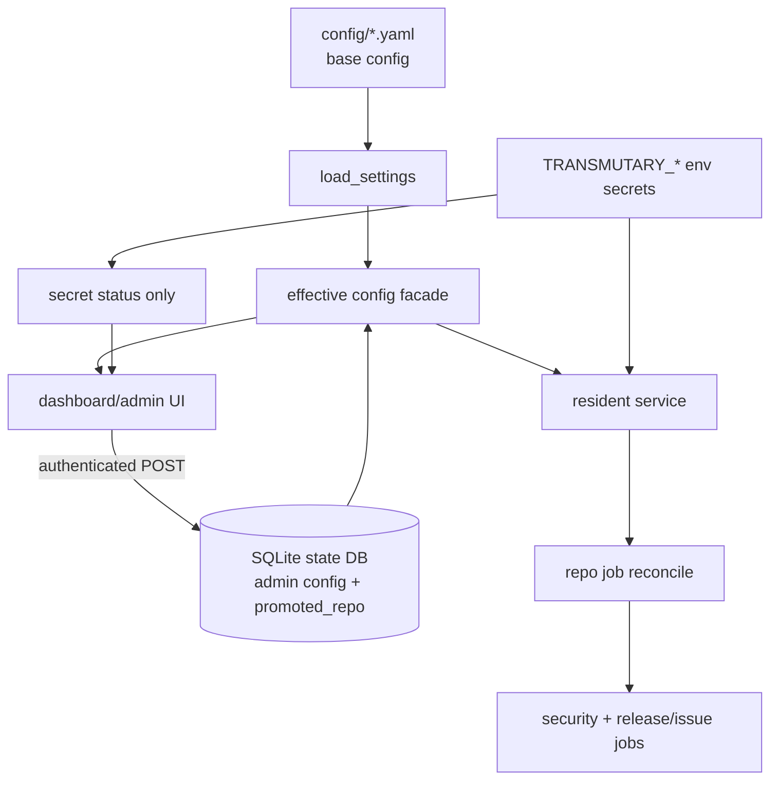

# feat: dashboard admin config control plane

## Summary

Turn the existing dashboard from "runtime viewer + promote shortcut" into a small admin control plane: operators can configure tracked repositories, dependency edges, trend scope, and non-secret delivery preferences from the Web UI, while secrets remain environment-only. The plan extends the current Starlette/Jinja2 dashboard, SQLite state store, service reconcile loop, and Docker packaging instead of introducing a new frontend stack or replacing YAML config.

---

## Problem Frame

The current Web UI can view runtime state and archived reports, and it can promote/demote Mode B candidates through the `promoted_repo` table. That is useful, but it does not yet let a self-hosted user configure the product from the browser: `watchlist.yaml`, `trend_scope.yaml`, and `delivery.yaml` still have to be edited out of band, and Docker deployment exposes the resident service more clearly than the dashboard/admin path.

That gap matters because Transmutary's core job is continuous observation. A user who sees a hot candidate, wants to add a repository, adjust trend keywords, or change digest recipients should not have to shell into a host or container for routine non-secret configuration. At the same time, these writes are higher risk than promote/demote, so the existing "localhost plus CSRF" posture is not enough.

---

## Requirements

**Admin Configuration**

- R1. The dashboard provides an authenticated admin settings area for non-secret configuration: tracked repositories, manual dependency edges, trend topics/keywords, digest hour, email recipients, and delivery status.
- R2. Web edits must take effect without editing YAML files directly and without restarting the resident service for repository-scope changes.
- R3. YAML remains a valid bootstrap/base configuration source; existing CLI, service, tests, and Docker read paths must continue to work for users who do not use Web admin.
- R4. Effective runtime configuration is inspectable with source labels so an operator can tell whether a value came from YAML base config or Web-admin state.

**Security and Secrets**

- R5. Admin writes require built-in identity authentication in addition to CSRF, Origin/Referer checks, Host allow-listing, confirmation where destructive, and existing public-bind gates.
- R6. Provider and delivery secret values are never configured through this first admin UI, never rendered, never persisted in SQLite, and never written to reports or docs examples. The admin token is accepted only by the login flow and is not persisted; the settings UI only reports whether required secret env vars are configured.
- R7. Admin write endpoints stay unavailable unless explicitly enabled by the dashboard entrypoint; public exposure must be loud, deliberate, and documented as requiring HTTPS and an admin token.

**Runtime and Delivery**

- R8. Repository and dependency-edge changes participate in the same effective watchlist/reconcile model as promoted repos so the service's scheduled jobs converge to the Web-admin state.
- R9. Trend scope and delivery preference changes affect future trend/delivery ticks through a single effective-config read path; unsafe runtime changes such as state DB path and artifact root remain YAML-only.
- R10. Email account handling separates routing preferences from credentials: recipients/digest timing may be Web-managed, while SMTP username/password remain environment-managed.

**Docker and Operations**

- R11. Docker deployment is a first-class path for both the resident service and dashboard/admin UI, with clear compose wiring, volumes, health checks, env examples, and reverse-proxy/TLS guidance.
- R12. Documentation states the recommended self-hosting shape, auth boundary, secret boundary, and upgrade path from existing YAML-only deployments.

---

## Key Technical Decisions

- KTD1. DB-backed admin overrides, not direct YAML editing: Web admin writes structured rows into SQLite and the runtime computes effective config from `YAML base + admin overrides + promoted repos`. Direct YAML editing would fight Docker read-only config mounts, comment/format preservation, concurrent file writes, and live reload semantics.
- KTD2. YAML remains bootstrap and compatibility surface: `load_settings()` continues to parse the three YAML files. A new effective-config layer wraps `Settings` plus store-managed admin state for callers that need live Web-managed values.
- KTD3. Admin auth is mandatory for config writes: introduce a minimal built-in admin-token/session flow rather than relying solely on external proxies. CSRF remains necessary but is not identity.
- KTD4. Provider secrets stay env-only in this milestone: the UI may show configured/missing status for GitHub, SMTP, RSS, LLM, and admin token env vars, but it does not input or persist provider credentials. The admin token is used only to establish a session. A future secrets-store design can widen this boundary deliberately.
- KTD5. Service convergence uses reconcile, not process-local mutation: admin repository changes are picked up by the resident service through effective watchlist reconciliation, matching the cross-process promote/demote model.
- KTD6. Dashboard UI extends the existing dense operations design: server-rendered Jinja templates, the current sidebar, CSS variables, compact tables/forms, and no new frontend framework. Settings pages should feel like configuration panels inside the existing dashboard, not a separate app.
- KTD7. Docker work is deployment polish over existing artifacts: keep the current wheel-based non-root image, then add compose roles/profiles, health checks, env examples, and docs for dashboard/admin. Do not create a second unrelated packaging system.

---

## High-Level Technical Design

Admin pages should share the existing dashboard shell:

- Sidebar gains `Overview` and `Settings`; active state is server-rendered.
- Settings overview shows compact status rows: config source counts, secret status, Docker/runtime status, and write-mode status.
- Repositories tab shows effective repos with source chips (`config`, `admin`, `promoted`), add/remove controls, and demote/remove disabled for YAML-owned rows.
- Dependency edges tab uses two repo selects and an edge table; validation rejects endpoints not present in the effective tracked repo set.
- Trend scope tab edits topics and keywords as simple repeatable rows/tags.
- Delivery tab edits recipients and digest hour, shows SMTP credentials as configured/missing, and leaves state DB path/artifact root read-only.

Interactions stay server-rendered and testable: POST form, validation error re-render, 303 on success, confirmation for destructive removals, no inline style, CSP nonce only for the existing theme bootstrap.

---

## Implementation Units

### U1. Admin Config Store Schema and APIs

- **Goal:** Add structured SQLite persistence for Web-managed non-secret config.
- **Files:** `src/transmutary/store/state.py`, `tests/store/test_state.py`.
- **Patterns:** Existing `promoted_repo` CRUD, `busy_timeout_ms`, explicit store methods, credential scrubbing before persistence.
- **Approach:** Add admin tables for tracked repos, dependency edges, trend topics/keywords, and delivery preferences. Methods should be deterministic, idempotent where natural, and sorted on read. Persist only non-secret strings/numbers.
- **Test Scenarios:**
  - Add/list/remove admin tracked repos with deterministic ordering and no duplicates.
  - Add/list/remove dependency edges; duplicate edges are idempotent.
  - Reject or ignore invalid edge endpoints at the effective-config validation layer, not by silently producing a broken runtime config.
  - Set/list trend topics and keywords with stable ordering.
  - Set delivery recipients and digest hour; do not store SMTP username/password or any `TRANSMUTARY_*` secret value.
  - `dump_all_text` and credential scrub tests confirm admin config rows cannot expose credential-shaped values unredacted.

### U2. Effective Config Facade

- **Goal:** Centralize `YAML base + DB admin overrides + promoted repos` composition so dashboard, service, and future CLI paths do not diverge.
- **Files:** `src/transmutary/config.py`, `src/transmutary/watchlist.py`, likely new `src/transmutary/effective_config.py`, `tests/test_config.py`, `tests/test_service.py`, `tests/test_pipeline.py`.
- **Patterns:** Existing frozen `Settings` dataclasses, `watchlist.effective_repos(settings, store)`, explicit parse errors via `ConfigError`.
- **Approach:** Introduce a facade or pure helpers that compute effective watchlist, dependency edges, trend scope, and delivery preferences. Keep filesystem paths and credentials from base `Settings`; merge only safe mutable fields. Return source metadata for dashboard read models.
- **Test Scenarios:**
  - Config-only deployment produces identical effective results to current behavior.
  - Admin repo plus YAML repo plus promoted repo dedupe into one sorted effective watchlist with source labels.
  - Admin dependency edge endpoints must reference effective tracked repos.
  - Admin trend topics/keywords are merged or override according to one documented rule, with deterministic results.
  - Admin delivery recipients/digest hour affect effective delivery, while `state_db_path`, `artifact_root`, `feed_dir`, `smtp_host`, and credentials keep the intended base/env boundary.
  - Missing store degrades to YAML-only for backward-compatible tests and read-only contexts.

### U3. Admin Authentication and Write Gate

- **Goal:** Add built-in admin identity for settings writes while preserving existing CSRF and public-bind defenses.
- **Files:** `src/transmutary/dashboard/app.py`, likely new `src/transmutary/dashboard/auth.py`, `src/transmutary/dashboard/csrf.py`, `tests/test_dashboard.py`.
- **Patterns:** Existing `CSRFMiddleware`, Host allow-list middleware, `resolve_bind`, `resolve_write_store`, generic error pages, no debug leakage.
- **Approach:** Use an env-provided admin token to establish an HttpOnly/SameSite session cookie. Store only a token-derived verifier or signed session value, never the raw token. Gate all `/settings` POSTs and sensitive GETs behind admin auth. Local read-only overview can remain credential-free.
- **Test Scenarios:**
  - Without admin token configured, settings writes are disabled and the UI shows an explicit unavailable state.
  - Login with correct token sets a secure session cookie; incorrect token fails without leaking expected values.
  - Authenticated POST still requires CSRF and Origin/Referer checks.
  - Unauthenticated `/settings` POSTs do not mutate store.
  - Public bind without explicit admin/write flags does not expose settings writes.
  - Session cookie attributes are `HttpOnly`, `SameSite`, path-scoped, and `Secure` when public/HTTPS mode is enabled.

### U4. Settings Read Models and Routes

- **Goal:** Build server-side data models and routes for settings pages without leaking secrets or store handles into templates.
- **Files:** `src/transmutary/dashboard/app.py`, `src/transmutary/dashboard/data.py`, `src/transmutary/dashboard/i18n.py`, `tests/test_dashboard.py`.
- **Patterns:** Existing `Overview`/`RepoRuntime` dataclasses with explicit `to_dict()`, `_safe_url`, `writes_enabled`, Jinja autoescape.
- **Approach:** Add route handlers for settings overview and per-section forms. Keep JSON read parity for agents where useful, but do not introduce unauthenticated mutation APIs. Re-render validation errors with form values and field-level messages.
- **Test Scenarios:**
  - Settings overview returns source counts and secret configured/missing statuses without raw env values.
  - Repo settings show config/admin/promoted rows with correct action availability.
  - Invalid repo names, duplicate dependency edges, missing edge endpoints, invalid digest hour, and invalid email addresses produce non-mutating validation errors.
  - JSON responses contain explicit allow-listed keys only.
  - i18n keys for EN and zh remain symmetric.

### U5. Settings Templates and CSS

- **Goal:** Add a compact, coherent admin UI that fits the existing dashboard design system.
- **Files:** `src/transmutary/dashboard/templates/base.html`, new settings templates under `src/transmutary/dashboard/templates/`, `src/transmutary/dashboard/static/dashboard.css`, `src/transmutary/dashboard/static/dashboard.js` only if needed, `tests/test_dashboard.py`.
- **Patterns:** Existing sidebar, `.card`, `.tbl`, `.pill`, `.action-link`, focus states, light/dark CSS variables, zero inline style.
- **Approach:** Add a Settings nav item and section pages using dense tables and small forms. Use status chips, disabled controls with clear labels, and destructive confirmation pages. Avoid nested cards and avoid marketing-style copy.
- **Test Scenarios:**
  - Navigation renders Overview and Settings with correct active state.
  - Settings forms include CSRF hidden fields and preserve values after validation errors.
  - YAML-owned rows cannot show destructive remove actions; admin-owned rows can.
  - Secret status rows render configured/missing labels but never raw values.
  - Rendered pages contain no inline `style=` and no un-nonced inline scripts.
  - Mobile layout keeps forms and tables readable without overlapping controls.

### U6. Service and Pipeline Effective Config Adoption

- **Goal:** Make runtime jobs use the effective Web-admin config where it matters.
- **Files:** `src/transmutary/service.py`, `src/transmutary/pipeline.py`, `src/transmutary/watchlist.py`, `tests/test_service.py`, `tests/test_pipeline.py`.
- **Patterns:** Existing `effective_repos`, `reconcile_repo_jobs`, `PipelineRuntime`, `register_pipeline_jobs`.
- **Approach:** Extend reconcile to include admin-managed tracked repos. Ensure future trend ticks use effective trend scope and future delivery uses effective non-secret delivery preferences. Keep credentials and immutable filesystem paths from base settings/env.
- **Test Scenarios:**
  - Service boot registers jobs for YAML, promoted, and admin-managed repos.
  - Reconcile picks up admin repo additions/removals across process boundaries.
  - Removing an admin repo does not unregister YAML-owned repos.
  - Trend tick reads effective topics/keywords.
  - Delivery uses effective recipients/digest hour for future sends without requiring process restart where feasible.
  - Existing config-only service tests still pass unchanged or with only fixture updates.

### U7. Docker and Compose Deployment Polish

- **Goal:** Make Docker a clear supported way to run service plus dashboard/admin.
- **Files:** `Dockerfile`, `docker-compose.yml`, `.env.example`, `README.md`, possibly new docs under `docs/`.
- **Patterns:** Existing multi-stage wheel image, non-root UID, `/config` and `/var/lib/transmutary` directories, compose named volume.
- **Approach:** Keep one image but define explicit compose services or profiles for resident service and dashboard. Add health checks for both entrypoints, expose dashboard deliberately, document reverse proxy/TLS and env secret requirements. Add `TRANSMUTARY_ADMIN_TOKEN` to env examples. Preserve read-only config mounts.
- **Test Scenarios:**
  - `docker compose config` validates with the documented env shape.
  - Compose keeps config read-only and state persistent.
  - Dashboard service has a health check against `/healthz`.
  - Service and dashboard share the same state volume and config mount.
  - `.env.example` contains admin token and existing credential placeholders without real secrets.

### U8. Documentation and Release Notes Prep

- **Goal:** Update product docs so users understand the new admin boundary and deployment path.
- **Files:** `README.md`, `CONTEXT.md`, possibly `docs/operations/docker.md`.
- **Patterns:** Current README sections for configuration, promotion, Docker deployment, dashboard, roadmap.
- **Approach:** Document Web-managed fields, env-only secrets, Docker self-hosting, admin token setup, and remaining deferred items. Update roadmap from "Web editing deferred" to the exact shipped scope once implemented.
- **Test Scenarios:** Documentation review only: commands match actual entrypoints, paths are current, and secret examples remain placeholders.

---

## Scope Boundaries

### In Scope

- Web admin for non-secret tracked repos, dependency edges, trend scope, recipients, digest hour, and config/status visibility.
- Built-in admin token/session auth for settings writes.
- SQLite-backed admin overrides and effective-config composition.
- Service reconcile adoption for admin-managed repository scope.
- Docker/compose/env/docs updates for service plus dashboard/admin self-hosting.

### Deferred for Later

- Storing or rotating SMTP/GitHub/RSS/LLM credentials through the Web UI.
- Multi-user accounts, RBAC, OAuth/OIDC, or audit-log UI.
- Subscription routing rules beyond the current delivery preferences.
- Automatic dependency-edge discovery from runtime behavior.
- Full live scheduler control from the dashboard.

### Outside This Product's Identity

- Turning Transmutary into a generic secrets manager.
- Automatic upgrade PRs or remediation actions; the product remains an observation and intelligence system.

---

## Risks and Dependencies

| Risk | Mitigation |
|---|---|
| Admin config source precedence becomes confusing | Show source labels in UI and document exact merge/override rules in the effective-config facade. |
| Web writes accidentally store secrets | Keep admin schema secret-free, test `dump_all_text`, and render only configured/missing secret status. |
| Runtime partially adopts config changes | Make effective-config adoption explicit by unit: repos via reconcile, trend/delivery on future ticks, filesystem paths YAML-only. |
| Public dashboard exposure becomes a security footgun | Require admin auth for settings, keep public flags explicit, set secure cookie behavior for public mode, and document reverse-proxy/TLS requirements. |
| Docker volume permissions fail for non-root UID | Preserve current UID model and document/chmod requirements; validate compose state volume path. |
| Direct YAML users feel migrated unexpectedly | Keep YAML-only behavior working and make DB admin overrides additive/explicit rather than silently rewriting files. |

---

## Acceptance Examples

- AE1. A Docker user starts service plus dashboard, logs in with the admin token, adds `owner/repo` in Settings, and the resident service registers jobs for that repo on the next reconcile tick without editing `watchlist.yaml`.
- AE2. A user adds a dependency edge between two effective tracked repos; adding an edge to an unknown repo shows a validation error and does not mutate the store.
- AE3. A user updates trend topics and keywords from the Web UI; the next trend run uses the effective scope while existing YAML-only deployments behave as before.
- AE4. A user updates email recipients and digest hour from the Web UI; SMTP password remains in env and the UI only shows that SMTP credentials are configured.
- AE5. An unauthenticated browser POST to a settings endpoint, even with a valid CSRF-looking body, does not mutate the state DB.
- AE6. A public dashboard bind without the explicit admin/write configuration exposes no settings mutation surface.

---

## System-Wide Impact

This feature changes the product's configuration model from "static YAML plus promoted_repo" to "static base config plus live admin state." The state DB becomes part of the administrative source of truth, so backup/restore docs must include it. Service scheduling becomes more dynamic, but still bounded by reconcile rather than arbitrary live scheduler RPC. Security posture also moves from a mostly read-only dashboard to authenticated admin operations, so tests must treat dashboard writes as privileged state transitions.

---

## Sources and Existing Patterns

- `docs/brainstorms/2026-05-29-repo-observation-system-requirements.md` defines Web dashboard as the target main surface and keeps secrets out of source/config.
- `docs/plans/2026-06-01-002-feat-dashboard-promote-ui-plan.md` established the dashboard write threat model, CSRF, Origin checks, public write gates, and CLI/agent parity boundary.
- `src/transmutary/dashboard/app.py` contains the current Starlette app, middleware stack, promote/demote routes, host allow-list, CSP nonce, and dashboard entrypoint.
- `src/transmutary/dashboard/data.py` is the dashboard's safe view-model layer with explicit JSON allow-lists and no credential fields.
- `src/transmutary/store/state.py` contains the SQLite schema and promoted repo CRUD patterns to extend.
- `src/transmutary/watchlist.py` currently centralizes effective watchlist computation for config plus promoted repos.
- `src/transmutary/service.py` contains reconcile-based job registration, the right runtime convergence pattern for cross-process Web writes.
- `Dockerfile`, `docker-compose.yml`, and `.env.example` already provide the base non-root image, config mount, state volume, and env-secret shape to polish rather than replace.
