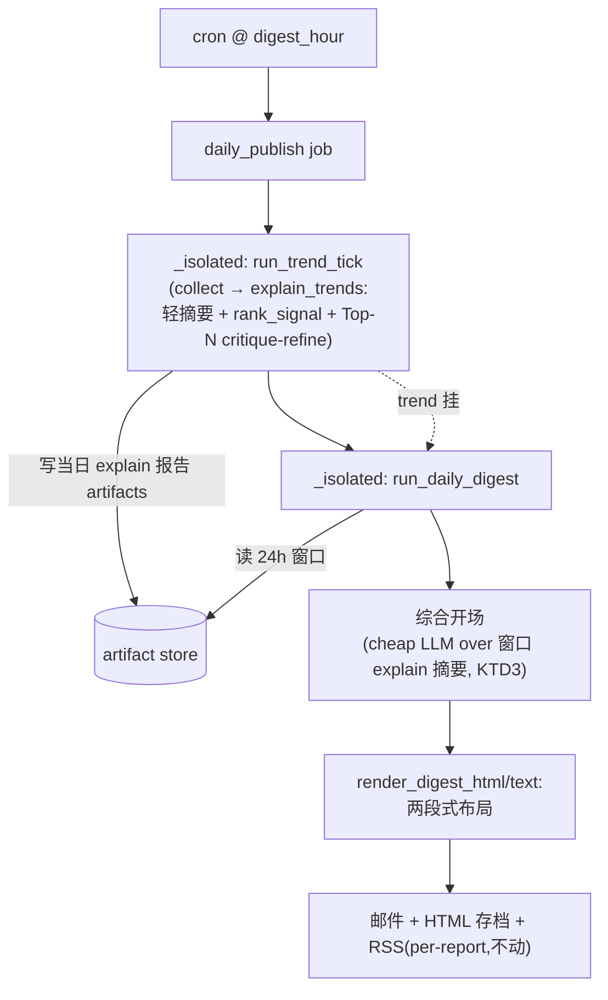

# feat: Trend digest 简报重设计 — 补完 R11 两层 + 报告信息架构 + 修调度竞态

## Summary

当前订阅方收到的每日 digest 邮件是「24h 窗口内全量报告每个渲成等权 article 卡片」的拼接——一次 trend tick 产 50 个候选 → 50 张灰色 `NORMAL` 卡瀑布,无排序、无层次、无重点,多数卡是「new candidate, no growth this run」噪声。这把流水线**中间态**(批量轻摘要)原样转发给了订阅方,而非**成品**(简报)。

根因两维:
- **内容(R11 欠账)**:需求 R11 设计是两层——「批量轻摘要 + 重要性过阈值触发单事件深挖」。实际只实现第一层,无排序、无深挖触发。
- **呈现(设计欠账)**:R10/计划 `2026-06-04-001` 只做到「能渲染 HTML、CJK、a11y、邮件安全内联 CSS」,没做「好读的报告布局」。

本计划把 trend 投递的**邮件 + dashboard digest 面**重设计成真简报:LLM 综合开场 + 按 growth 降序的 Top-N 领涨详卡(过阈值触发 critique-refine 深挖) + 长尾紧凑静态表。连带修一个**先于本计划存在的调度竞态**(trend tick 与 digest 同 cron 同时触发、无顺序保证,导致 digest 可能聚不到当日报告)。RSS 因可读性从未实测,本计划不动,另起 follow-up 先实测。

---

## Problem Frame

### 现状(grounded,本会话实测 + 代码核查)
- `run_daily_digest`(`src/transmutary/pipeline.py`)→ `collect_digest_reports`(`src/transmutary/deliver/digest.py`)读「`ReportRef.ts >= now-86400`」全量报告 → `render_digest_html` 把每个报告渲成等权 `<article>` 卡。
- `render_digest_html` 的卡片排序 = `_SEV_ORDER`(severity)再按 `-ts`;trend 报告全是 `Severity.NORMAL` → 纯按时间,**无 growth 排序**。
- trend 候选漏斗 = `filter_scope`(`src/transmutary/collect/trend.py`,仅 AI topic/keyword 范围),**无 growth/质量阈值** → 50 候选全过、全成报告。
- `explain_trends`(`src/transmutary/report/explain.py`)对全批做**一次** cheap LLM 批量轻摘要;已有 `refine` flag(默认关)走 `critique_refine`(`src/transmutary/report/refine.py`)。
- digest 邮件正文 == `_digest/{date}.html` 产物(同一渲染器,无第二套)。

### 调度竞态(连带修,先于本计划存在)
`register_pipeline_jobs`(`src/transmutary/service.py:282/293`)把 `trend` 与 `daily-digest` 都注册为 `trigger="cron", hour=delivery.digest_hour`(分钟默认 0)→ 同一时刻触发的两个独立 job,APScheduler `ThreadPoolExecutor` 并发执行、**顺序未定义**。

计划 `2026-06-04-001` KTD6 当初依据「固定 24h 窗口 = 幂等 = 顺序无关」放同一 cron。该推理盲区:**窗口长度(24h)== tick 周期(每日)== 同触发时刻**,三者对齐使窗口边界正好切在 tick 事件上:
- digest 先跑 → 当日报告未写入 + 昨日报告刚老化出窗 → **趋势区全空**。
- trend 先跑 → 当日报告进窗 → 正常。

纳入与否完全看那次谁先抢到线程。这是设计 smell,非有意。放宽窗口(如 26h)不可行——trend 先跑会致当日+昨日**重复报告**。

---

## Requirements

源自 `docs/brainstorms/2026-05-29-repo-observation-system-requirements.md`:

- **R-A(补完 R11 两层)**:trend 候选按 growth 排序;`new candidate 无增长` 折叠长尾(保留不删);Top-N 领涨候选触发单事件深挖(critique-refine)。
- **R-B(报告信息架构)**:digest 从「等权卡 dump」改为分层简报——LLM 综合开场 + Top-N 详卡 + 长尾紧凑表;可扫读、有视觉层次。
- **R-C(综合开场)**:digest 渲染时一次 cheap LLM 调用,over 窗口内 explain 报告的摘要,产出整体图景叙事;注入安全沿用 KTD3 数据/指令分槽。
- **R-D(修调度竞态)**:消除 trend/digest 同时触发的竞态,保证 digest 读窗口时当日 trend 报告已写入;保留 per-job 故障隔离(R19)。
- **R-E(分级不变,R15/R16)**:immediate 高危仍即时单发;diagnose/security(模式A)报告在 digest 里保持独立语义,不被趋势重设计改写。
- **R-F(双轨渲染,R8/R9)**:邮件 HTML 用安全内联 CSS(邮件客户端例外)、dashboard CSP 不破;CJK 字体栈 + a11y(语义标签、severity 不只靠色)维持。
- **R-G(标题去重)**:explain body 不再以 `## Trending:{repo}` 自标题开头(单报告 HTML + digest 同受益)。【本会话已实现,未提交,纳入本计划】

---

## Key Technical Decisions

**KTD1:综合开场在 digest 渲染时算,不在 trend tick 时预算。**
理由:digest 才是成品,综合必须与 digest 实际窗口内容一致。tick 时预算会因调度竞态(见 R-D)与窗口边界对齐而读到旧/空数据。`run_daily_digest` 已持有 `rt`,可经 `_tier_creds(rt,"cheap")` 取 LLM 凭据(`run_trend_tick` 已用同款)。代价:digest 新增一次 cheap 调用。

**KTD2:修调度竞态 = 合并成单个顺序 job,非时间偏移、非事件式。**
`trend` + `daily-digest` 合并为一个 `daily_publish` job:顺序 `run_trend_tick` → `run_daily_digest`,**每段各包 `_isolated`**。
- 否决「digest 偏移 N 分钟」:靠魔法数字赌 tick 总在 N 分钟内跑完,tick 变慢竞态即回,与原 bug 同类脆弱。
- 否决「事件式(trend 完成事件触发 digest)」:APScheduler listener 跑在调度线程不能干重活 → 须 listener 里二次 `add_job`,多两跳间接 + 失败语义绕 + 难测;事件式的解耦收益在**单进程、铁定 1 生产者→1 消费者**场景用不上(YAGNI)。
- 顺序合并:顺序由代码保证(非时机运气),竞态从构造上消除;per-phase `_isolated` 保留隔离(trend 挂 → digest 照跑,聚 24h 窗口内 mode-A diagnose);24h 窗口对全天连续产的 mode-A 报告仍正确。

**KTD3(沿用既有 KTD3):综合 over 不可信摘要的注入隔离。**
综合指令进 system 槽(可信);窗口内各 explain 报告的 `### Summary` 文本进 data 槽(当第三方文本)。摘要虽 LLM 产出仍按不可信处理,不能反向操纵综合。复用 `explain.py`/`refine.py` 既有数据/指令分槽模式。

**KTD4:Report 加结构化排序信号,digest 据此确定性分层。**
`Report` 加可选字段 `rank_signal: float | None = None`(承载 `growth_per_day`)。`explain_trends` 产报告时写入;digest 按 `rank_signal` 降序,`None` 沉长尾(组内按 stargazers 兜底)。避免 digest 从 body 文本解析 growth(脆弱)。Top-N 选取 = `rank_signal` 非空的前 N。

**KTD5:Top-N 的 N + 深挖触发 = 可调常量,默认 N=8。**
`explain.py` 模块常量 `TREND_TOP_N = 8`。growth 为 `None`/0 不进 top(无信号不臆断)。深挖 = 对 top-N 开 `critique_refine`(基建已在 `refine.py`)。不设硬 funnel gate(避免漏边缘信号),分层靠排序+折叠而非删除。

**KTD6:邮件 tail 用静态紧凑表,不用 `<details>`。**
Gmail 等邮件客户端剥离 `<details>`。digest HTML 主要是邮件正文,故长尾 = 静态紧凑表(repo + 1 行摘要 + stars/growth),不靠折叠交互。

**KTD7:综合不持久化为 Report,无新 ReportKind。**
综合是 digest 渲染期生成的一段串,渲进 digest HTML 头部(随 digest HTML 一并存档),不进 schema、不新增 `ReportKind`。

---

## High-Level Technical Design

### 合并后的每日发布流程(修竞态)



`trend` 挂时虚线:`_isolated` 吞掉异常,`digest` 仍跑(聚窗口内 mode-A diagnose)。

### digest 两段式信息架构

```
Daily Digest {date}
概览:N 个事件(M 高危)

┌─ 区1:高危/诊断(模式A，独立)──────────┐
│  [CRITICAL] repo · 外部诊断标题            │  ← 个体卡，语义不变
│  [HIGH] repo · 供应链告警                  │
└────────────────────────────────────────┘

┌─ 区2:趋势(模式B，简报)────────────────┐
│  〈综合开场〉本窗口 K 个 AI 趋势，主题集中  │  ← KTD1 LLM 叙事
│   于 agent 框架/代码工具…头部领涨 X/Y/Z    │
│                                          │
│  Top 领涨(按 growth 降序，Top-N 详卡)：   │
│   ★ repo  +123 stars/day                 │  ← 深挖(critique-refine)
│     summary…  Stars/Topics                │
│   ★ repo  +88 stars/day  …                │
│                                          │
│  其余趋势(长尾，静态紧凑表)：             │  ← KTD6 无 <details>
│   repo | 1行摘要 | stars | growth         │
│   repo | …                                │
└────────────────────────────────────────┘
```

---

## Implementation Units

### U1. Report.rank_signal 排序信号字段

**Goal:** Report 携带结构化排序信号,供 digest 确定性分层(KTD4)。
**Requirements:** R-A, R-B
**Dependencies:** 无
**Files:**
- `src/transmutary/report/schema.py`(`Report` 加 `rank_signal: float | None = None`)
- `tests/report/test_schema.py` 或对应 schema 测试
- `tests/store/test_artifacts.py`(json sidecar round-trip)
**Approach:** 镜像现有可选字段(如 `title_zh`)模式:dataclass 默认 `None`、`to_dict`/`from_dict` 带上(`d.get("rank_signal")` 向后兼容)。
**Test scenarios:**
- `Report(rank_signal=123.0)` round-trips through `to_dict`/`from_dict`;旧 dict 无该键 → `None`(向后兼容)。
- json sidecar 含 `rank_signal`。
- `Test expectation`:纯字段加法,行为测试限于序列化往返。

### U2. explain_trends 排序 + Top-N 深挖 + 标题去重

**Goal:** trend tick 产报告时按 growth 排序写 `rank_signal`、选 Top-N 跑 critique-refine 深挖;纳入已做的 body 自标题去重(R-G)。
**Requirements:** R-A, R-G
**Dependencies:** U1
**Files:**
- `src/transmutary/report/explain.py`(排序/`rank_signal` 写入/Top-N 选取/对 top-N 调 `critique_refine`;已含删 `## Trending:{repo}`/`## 热门趋势：{repo}` 自标题)
- `src/transmutary/report/refine.py`(若需暴露单条 refine 入口,只读复用,不改语义)
- `tests/report/test_explain.py`(或现有 explain 测试)
**Approach:**
- `explain_trends` 内对候选按 `growth_per_day` 降序;每报告设 `rank_signal = growth_per_day`(`None` 保留)。
- 模块常量 `TREND_TOP_N = 8`(KTD5);`rank_signal` 非空的前 N 个标为 top,对其代表摘要走 `critique_refine`(沿用现有 `refine` 基建 + KTD3 分槽)。长尾候选维持单次轻摘要。
- critique-refine 失败按既有 KTD-D 优雅降级(回落原草稿 + audit note,不丢报告)。
**Patterns to follow:** 现有 `explain_trends` 的 batch + dedup + `refine` flag;`refine.py` 的 `critique_refine` 数据/指令分槽。
**Test scenarios:**
- 批含 growth 各异候选 → 各报告 `rank_signal` == 其 `growth_per_day`;`None` 候选 `rank_signal is None`。
- Top-N 选取:growth 降序前 8 标 top;第 9+ 与 `None` 不在 top。
- top 候选触发 critique-refine(注入 spy/fake call_fn 断言 refine 调用次数 == top 数);长尾不触发。
- refine 阶段失败 → 回落原摘要 + `refine_notes` 记录,报告不丢(覆盖 KTD-D)。
- 回归:body 不再含 `## Trending:` / `## 热门趋势：`;现有双语 body 解析、dedup 指纹不受影响。

### U3. 合并调度为 daily_publish 顺序 job(修竞态)

**Goal:** 消除 trend/digest 同时触发竞态,保证 digest 读窗口时当日 trend 报告已落盘(R-D/KTD2)。
**Requirements:** R-D, R-E
**Dependencies:** 无(可独立落地,但 U4/U5 的窗口正确性依赖它)
**Execution note:** 先写一个表征测试锁住「digest 在 trend 之后执行」的顺序契约,再改 `register_pipeline_jobs`。
**Files:**
- `src/transmutary/service.py`(`register_pipeline_jobs`:删独立 `daily-digest` job,新增单个 `daily_publish` cron job 顺序调 `run_trend_tick` 再 `run_daily_digest`,每段各 `_isolated`)
- `tests/test_service.py`(或现有 service 调度测试)
**Approach:** 一个 cron job(`hour=digest_hour`)→ job 函数内顺序:`_isolated("trend", run_trend_tick)` 然后 `_isolated("daily-digest", run_daily_digest)`。保留 `max_instances=1`/`coalesce=True`。`reconcile` job 不变。
**Patterns to follow:** 现有 `_isolated` 包装(R19);`register_pipeline_jobs` 既有 job 注册。
**Test scenarios:**
- 注册后只有一个 `daily_publish`(或等名)cron job @ digest_hour;无独立 `daily-digest` job(防回归同时触发)。
- job 执行顺序:trend 先、digest 后(spy 记录调用序)。
- trend 段抛异常 → 被 `_isolated` 吞、记录,digest 段仍执行(隔离保留)。
- digest 段抛异常 → 不影响调度器存活。
- `Covers R-D`。

### U4. digest 综合开场(LLM,KTD1/KTD3)

**Goal:** `run_daily_digest` 对窗口内 explain 报告做一次 cheap LLM 综合,产出趋势区开场叙事;注入安全 + 优雅降级。
**Requirements:** R-C
**Dependencies:** U3(窗口含当日报告才有意义)
**Files:**
- `src/transmutary/pipeline.py`(`run_daily_digest`:取 `_tier_creds(rt,"cheap")`,筛窗口内 explain 报告,调综合 LLM;空趋势 → 跳过)
- `src/transmutary/deliver/digest.py`(综合渲染入口 + 提示串)
- `tests/test_daily_digest.py`、`tests/deliver/test_digest.py`
**Approach:** 综合输入 = 窗口内 explain 报告的 `### Summary`(或 `localized_body` 摘要段)拼成 data 槽;综合指令进 system 槽(KTD3)。输出一段叙事串,传入渲染。注入 `call_fn` 测试 seam(沿用 pipeline 既有 `_UNSET`/`call_fn` 模式)。
**Test scenarios:**
- 窗口含 explain 报告 → 综合 LLM 被调用一次(`call_fn` spy),叙事串进 digest HTML 头部。
- 窗口无 explain 报告(全 diagnose 或空)→ 综合**跳过**,不调 LLM,digest 仍渲染。
- 注入安全:某报告摘要含 `IGNORE INSTRUCTIONS…` → 仍在 data 槽,综合指令在 system 槽(断言 prompt 构造分槽,不混入指令槽)。
- 综合 LLM 抛错 → 优雅降级(digest 照发,趋势区无开场或占位,不丢报告)。
- `Covers R-C`。

### U5. digest 两段式布局重设计(R-B/R-F/KTD6)

**Goal:** `render_digest_html`/`render_digest_text` 从等权卡 dump 改为两段式简报:diagnose/security 独立顶部区 + 趋势区(综合开场 + Top-N 详卡 + 长尾静态表);视觉层次、可扫读、邮件安全、CJK/a11y。
**Requirements:** R-B, R-E, R-F
**Dependencies:** U1(rank_signal 排序)、U2(top-N 标记/深报告)、U4(综合串)
**Files:**
- `src/transmutary/deliver/digest.py`(`render_digest_html`/`render_digest_text`/`_report_block` 重构:分区、按 `rank_signal` 排序、Top-N 详卡、长尾紧凑表)
- `tests/deliver/test_digest.py`
**Approach:**
- 分两组:`kind==DIAGNOSE`(+ 高危)→ 顶部个体卡(语义不变,R-E);`kind==EXPLAIN` → 趋势区。
- 趋势区:综合开场串(U4)→ 按 `rank_signal` 降序,`None` 沉底(组内 stargazers 兜底);前 `TREND_TOP_N` 渲详卡,其余渲静态紧凑表(repo + 1 行摘要 + stars/growth,KTD6 无 `<details>`)。
- 邮件安全内联 CSS(沿用现 `_SEV_STYLE`/`_FONT`);`<html lang>` + 语义标签 + severity 文字标签维持(R-F)。text 版同步分区。
**Patterns to follow:** 现有 `_report_block` 内联样式、`_SEV_ORDER`、`render_digest_html` 结构;`render_email_html` 的邮件安全样式。
**Test scenarios:**
- 窗口含 2 diagnose + 5 explain → HTML 有「诊断区(2 个体卡)」+「趋势区(综合 + Top-N + 长尾)」两段,顺序正确。
- 趋势区按 `rank_signal` 降序;`rank_signal=None` 的报告在长尾、不在 Top-N 详卡。
- Top-N 边界:explain 报告数 > N → 仅前 N 进详卡,其余进长尾表;<= N → 全详卡、无长尾表。
- 长尾用静态表(断言无 `<details>` 标签,KTD6)。
- 空趋势(仅 diagnose)→ 无趋势区或占位,诊断区正常。
- a11y/CJK 回归:`<html lang>` 正确、severity 有文字标签、CJK 字体栈在(沿用现有断言)。
- XSS 回归:报告标题/摘要含 `<script>` 仍转义。
- `Covers R-B, R-E, R-F`。

---

## Scope Boundaries

**In scope:** trend 投递的邮件 + dashboard digest HTML 重设计(综合开场 + Top-N 深挖详卡 + 长尾表 + growth 排序)、Report.rank_signal、调度竞态修复(合并顺序 job)、explain body 标题去重。

**Out of scope(本质非目标):**
- diagnose 模式A 报告语义改写(仍进 digest 独立区,不被趋势重设计触碰)。
- immediate 高危即时单发路径(R15,不动)。
- 候选硬 funnel gate(选定排序+折叠,不删候选)。
- seen_set 去重逻辑(不动;digest 读 artifact 窗口,与去重自洽)。
- per-recipient 不同语言/订阅配置(R16 延后项,需求已 defer)。

**Deferred to Follow-Up Work:**
- **RSS 简报化**:RSS 可读性从未实测。另起 follow-up——先订阅 feed 进真 RSS reader 看渲染效果,再决定粒度(per-report vs 综合单条 vs 两者)与布局。本计划 RSS 维持现状 per-report(U2 的标题去重会改 entry 内容,属改善非粒度变更)。
- **R11 深挖三段式完整化**:本计划深挖 = 对 Top-N 开既有 critique-refine。更激进的「judge 分驱动深挖 / 跨候选主题聚类」留后续。
- **`TREND_TOP_N` / growth 阈值调参**:默认 N=8,实测后调。

---

## Risks & Dependencies

- **R1:digest 引入 LLM 依赖。** `run_daily_digest` 现无 LLM;新增 cheap 调用需 `rt` 凭据。缓解:经 `_tier_creds`(已有);综合失败优雅降级(U4),digest 不因 LLM 挂而停发。
- **R2:成本上升。** tick +N 次 refine(N≤8)、digest +1 次综合,均 cheap 档。有界、可接受(用户已认成本)。
- **R3:合并 job 改调度。** 删独立 digest job 可能影响依赖其 job id 的代码/测试。缓解:U3 表征测试锁顺序契约 + 检索 `daily-digest` id 引用。
- **R4:窗口边界 + 去重交互。** digest 读 24h artifact 窗口,被去重跳过的候选无新 artifact → 综合/排序 over 窗口实际报告,自洽;无需改去重。
- **R5:邮件客户端 HTML 兼容。** 长尾表须邮件安全(无 `<details>`、内联样式);沿用现有 `render_email_html` 兼容基线。

---

## Verification

1. `python -m pytest tests/ -q` 全绿(移开本地真实 `config/*.yaml` 避污染);`ruff check .` 通过。
2. headless 重生成一份 digest HTML 对照:50 候选 → 两段式(综合开场 + Top-N 详卡按 growth 降序 + 长尾静态表),无 50 张等权灰卡墙、无标题三连。
3. 调度:单测确认只一个 daily_publish job、trend 先 digest 后、trend 挂 digest 照跑。
4. 真发验证(可选,SMTP 已修):跑合并 job → 收 digest 邮件,确认简报布局、综合开场、Top-N 排序在真邮件客户端可读。
5. 掩码核查:综合/refine 的 LLM 调用与日志不泄露凭据(遵守 never-print-secrets)。
6. RSS 不回归:per-report entry 仍生成(内容随标题去重改善)。
